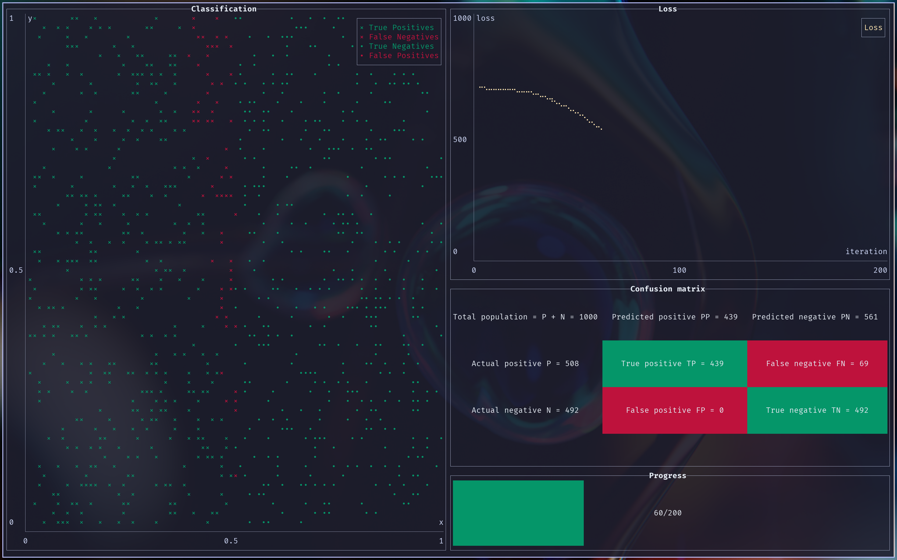

<h2 align="center">
  
  <br>
  allumette
</h2>

`allumette`, French for match, is a toy tensor library built for fun to better understand
tensors and autodifferentiation.

It is inspired by a small cohort of projects:

- [minitorch](minitorch.github.io)
- [tinygrad](https://github.com/tinygrad/tinygrad)
- [burn](https://github.com/tracel-ai/burn)
- [candle](https://github.com/huggingface/candle)
- [tensorken](https://github.com/kurtschelfthout/tensorken)

### Usage

```rust
use allumette::{
    backend::backend::GpuBackend,
    training::{
        dataset::Dataset,
        debugger::ChattyDebugger,
        train,
    },
};

fn main() {
    let pts = 1000;
    let dataset = Dataset::simple(pts);
    let hidden_layer_size = 3;
    let learning_rate = 0.1;
    let iterations = 200;
    // you have a choice of backend:
    // - CpuSeqBackend for sequential training
    // - CpuParBackend to leverage rayon's parallel iterators
    // - GpuBackend as below
    train::train::<GpuBackend, ChattyDebugger>(
        dataset,
        learning_rate,
        iterations,
        hidden_layer_size,
    );
}
```

[Dataset](./src/training/dataset.rs) provides a few ways to create synthetic datasets.

#### Visual debugger

There is also a visual debugger built with ratatui.

```rust
use std::io::Error;

use allumette::{
    backend::backend::CpuSeqBackend,
    training::{
        dataset::Dataset,
        debugger::VizDebugger,
        train,
    },
};

fn main() -> Result<(), Error> {
    let pts = 1000;
    let dataset = Dataset::diag(pts);
    let hidden_layer_size = 3;
    let learning_rate = 0.2;
    let iterations = 200;

    let mut debugger = VizDebugger::new(&dataset, iterations);

    let mut debugger_thread_clone = debugger.clone();

    std::thread::spawn(move || {
        train::train::<CpuSeqBackend, _>(
            dataset,
            learning_rate,
            iterations,
            hidden_layer_size,
            &mut debugger_thread_clone,
        );
    });

    debugger.run()
}
```



### Build and dependencies

Part of the codebase makes use of the `trait_alias` experimental features so it requires nightly.

The set of dependencies is otherwise pretty limited:
- `wgpu` for the GPU runtime
- `rayon` for the parallel CPU runtime
- `flume` and `futures` for wgpu callbacks
- `bytemuck` to convert binary buffers copied to/from the GPU
- `ratatui` for visualization
- `proptest` for property-based testing
- `rand` for synthetic data generation

### Next up

- [x] parallel backend
- [x] gpu backend
- [x] associated types
- [x] visualization
- [ ] convolution
- [ ] optimizations
- [ ] const generics for tensor ranks

### Gotchas / learnings

#### proptest

Seems like `proptest` distributions are truly uniform unlike quickcheck or scalacheck which do
hotspot values.
`relu'(x)` is undefined when `x = 0` and by convention I had chosen 0. The central diff however
reports nonsensical values.
The bug was there for months until I ported the same logic to GPU where I hit on 0 by chance.
C.f. https://github.com/proptest-rs/proptest/issues/82

#### proptest & GPU

GPU is fast except going to and from the CPU which happens a lot with prop tests

#### IGPs are slow

#### rust superpowers

- associated types
- const generics
