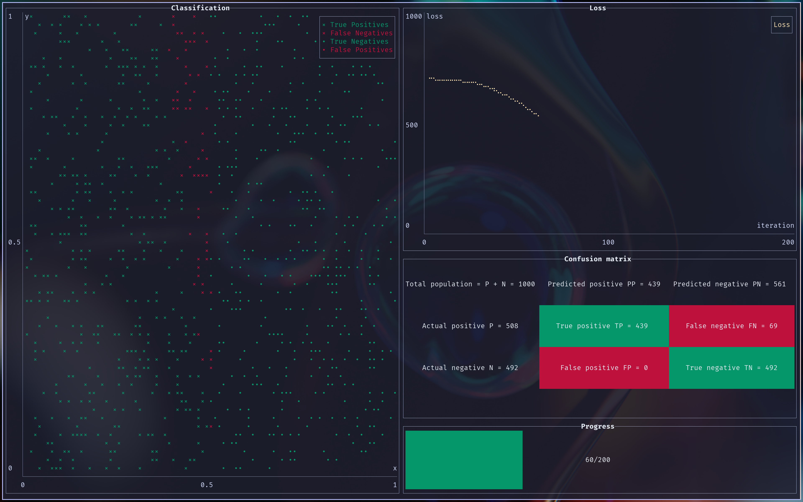

<h2 align="center">
  
  <br>
  allumette
</h2>

`allumette`, French for match, is a toy tensor library built for fun to better understand
tensors, autodifferentiation, neural networks and GPU programming.

It is inspired by a small cohort of projects:

- [minitorch](https://minitorch.github.io)
- [burn](https://github.com/tracel-ai/burn)
- [tensorken](https://github.com/kurtschelfthout/tensorken)

### Usage

There is a cli built on top which you can use to train a neural network.

For example, to train a neural network on cpu in parallel on:
- 1000 (10^3) points
- 100 iterations
- 0.15 learning rate
- 12 neurons in the hidden layer

```bash
$ allumette -b par -p 3 -i 100 -l 0.15 --hidden-layer-size 12
```

To train on gpu, you will need to set an env variable:

```bash
$ WGPU_ADAPTER_NAME="NVidia" allumette -b gpu -p 3
```

You can know more about the cli arguments with:

```bash
$ allumette help
Usage: allumette [OPTIONS] [COMMAND]

Commands:
  viz        
  benchmark  
  profile    
  help       Print this message or the help of the given subcommand(s)

Options:
  -b, --backend <BACKEND>
          [default: seq] [possible values: seq, par, gpu]
  -d, --dataset <DATASET>
          [default: star] [possible values: simple, diag, split, xor, circle, star]
  -p, --power-ten-points <POWER_TEN_POINTS>
          [default: 4]
  -i, --iterations <ITERATIONS>
          [default: 500]
  -l, --learning-rate <LEARNING_RATE>
          [default: 0.1]
      --hidden-layer-size <HIDDEN_LAYER_SIZE>
          [default: 50]
  -h, --help
          Print help
  -V, --version
          Print version
```

#### Visual debugger

There is also a visual debugger built with ratatui.

```bash
$ allumette viz -b gpu -p 3
```



### Benchmarks

You can run benchmarks with:
```bash
$ allumette benchmark -b gpu -p 5 -s 1234
```

- `b` stands for backend, you have a choice of `gpu`, `par` and `seq`.
- `p` is the number of points raised to the power of 10, e.g. 5 stands for 100 000 points
- `s` is the seed to generate synthetic data

### Profiling

There is a small profiling tool which helps understand in which operations time is spent, it can be
run with:

```bash
$ allumette profile -b gpu -p 5 -s 1234 -o /tmp/profile.csv
```

- `b` stands for backend, you have a choice of `gpu`, `par` and `seq`.
- `p` is the number of points raised to the power of 10, e.g. 5 stands for 100 000 points
- `s` is the seed to generate synthetic data
- `o` is the output path

an example analysis with [xan](https://github.com/medialab/xan):

```bash
xan groupby op '
    sum(duration_micros),
    min(duration_micros),
    max(duration_micros),
    mean(duration_micros),
    var(duration_micros),
    stddev(duration_micros)
' /tmp/profile.csv | xan view -I

xan groupby op 'sum(duration_micros) as sum' /tmp/profile.csv |
    xan sort -s sum -N -R |
    xan view -I
```

### Presentation

Slides were built to present this project, you can check them out with [presenterm](https://github.com/mfontanini/presenterm):

```bash
$ presenterm slides.md
```

### Build and dependencies

Part of the codebase makes use of the `trait_alias` experimental features so it requires nightly.

The set of dependencies is otherwise pretty limited:
- `wgpu` for the GPU runtime
- `rayon` for the parallel CPU runtime
- `flume` and `futures` for wgpu callbacks
- `bytemuck` to convert binary buffers copied to/from the GPU
- `ratatui` for visualization
- `clap` for cli argument parsing
- `proptest` for property-based testing
- `serial_test` for non parallel gpu tests
- `rand` for synthetic data generation

### Next up

- [x] parallel backend
- [x] gpu backend
- [x] associated types
- [x] visualization
- [ ] simd cpu backend
- [ ] abstract the number of hidden layers
- [ ] convolution
- [ ] optimizations
- [ ] const generics for tensor ranks
