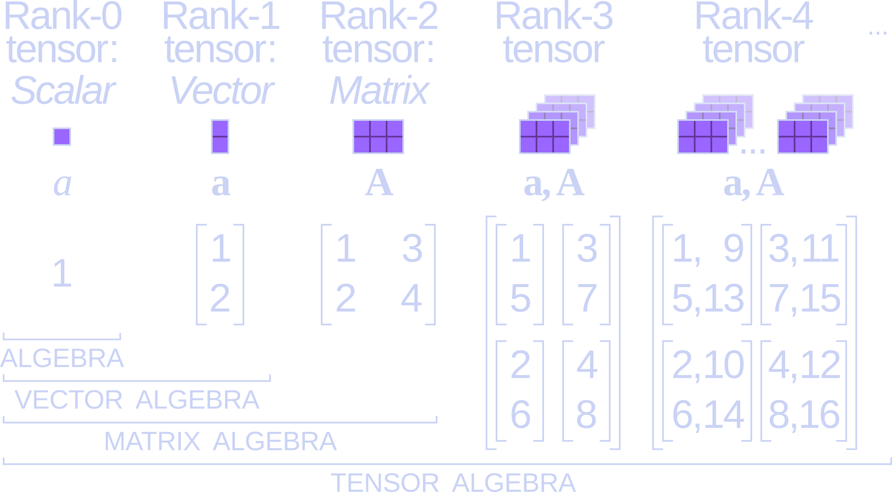
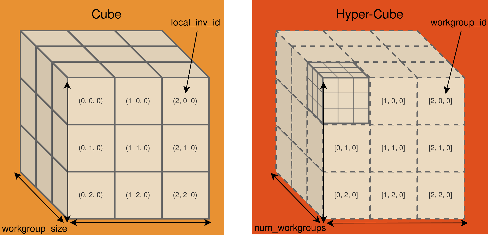
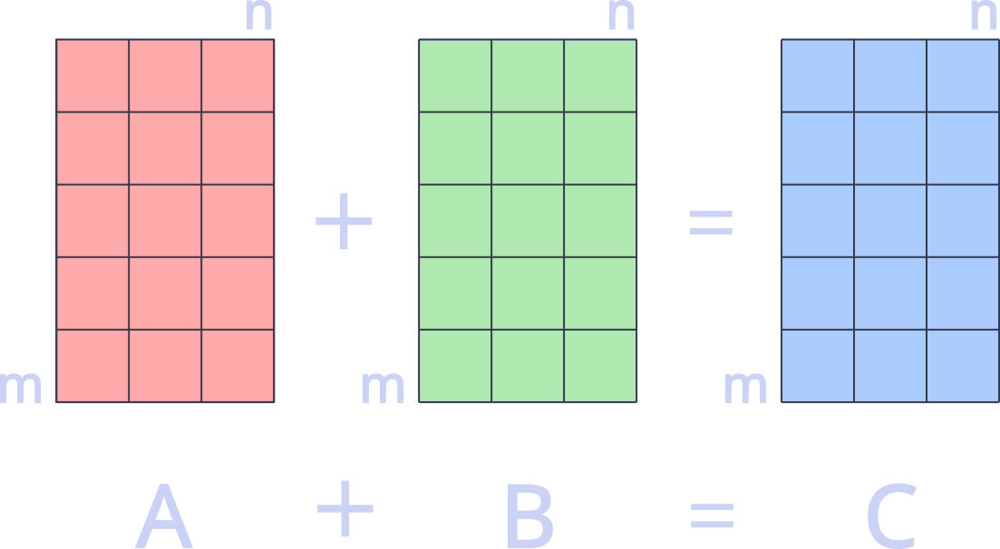

---
theme:
  name: catppuccin-macchiato
  override:
    default:
      margin:
        percent: 1
    typst:
      colors:
        background: cad3f500
        foreground: cad3f5
    footer:
      style: template
      left:
        image: img/logo.png
      #center: '**allumette**'
      right: "{current_slide} / {total_slides}"
      height: 3
    code:
      padding:
        vertical: 0
        horizontal: 0
      minimum_margin:
        percent: 0
options:
  end_slide_shorthand: true
---

<!-- newlines: 12 -->

<!-- column_layout: [1, 3] -->

<!-- column: 0 -->


<!-- column: 1 -->
<!-- newlines: 1 -->

<span style="color: #ed8796">**allumette**</span>

<span style="color: #f5a97f">a toy tensor library written in Rust</span>

<span style="color: #eed49f">Ben Fradet</span>

<!-- no_footer -->

---

What's a tensor?
===

if you recall your algebra classes...
<!-- newlines: 1 -->

<!-- alignment: center -->
credit: Cmglee, GNU FDL

---

What does a tensor look like in rust?
===

```typst +render +width:40%
#set table(
  stroke: none,
  inset: -1pt,
)

#let cell(angle: 170deg, dx: 0em, dy: 0em) = {
  stack(
    box(width: 100%, height: 100%),

    place(
      dx: dx,
      dy: dy,
      align(
        center,
        rotate(angle, line(length: 90%, stroke: (dash: "dashed", paint: rgb("#5b6078")))),
      ),
    )
  )
}

#table(
  columns: 4,
  [], [], [#cell()], [$mat(delim: "[", 41, 42; 43, 44)$],
  [], [#cell()], [$mat(delim: "[", 31, 32; 33, 34)$], [#cell(dy: 1em, angle: 170deg)],
  [#cell()], [$mat(delim: "[", 21, 22; 23, 24)$], [#cell(angle: 170deg, dy: 1em)], [],
  [$mat(delim: "[", 11, 12; 13, 14)$], [#cell(dy: 1em)], [], [],
)
```
<!-- newlines: 1 -->
<!-- pause -->

<!-- column_layout: [1, 1] -->

<!-- column: 0 -->
```rust +no_background
struct Tensor {
    data: Vec<f64>,
    shape: Shape,
    strides: Strides,
}
```
<!-- pause -->

<!-- column: 1 -->
```rust +no_background
let data = vec![
    11., 12., 13., 14.,
    21., 22., 23., 24.,
    31., 32., 33., 34.,
    41., 42., 43., 44.
];
```
<!-- pause -->

<!-- column: 0 -->
<!-- newlines: 1 -->
```rust +no_background
struct Shape {
    data: Vec<usize>,
}
```
<!-- pause -->

<!-- column: 1 -->
```rust +no_background
let shape = Shape::new(vec![4, 2, 2]);
```
<!-- pause -->

<!-- column: 0 -->
```rust +no_background
struct Strides {
    data: Vec<usize>,
}
```
<!-- pause -->

<!-- column: 1 -->
<!-- newlines: 2 -->
```rust +no_background
let strides = Strides::new(vec![4, 2, 1]);
```
<!-- pause -->

<!-- reset_layout -->
```rust +no_background
let tensor = Tensor { data, shape, strides };
```

---

What can be done with a tensor?
===

<!-- newlines: 5 -->
<!-- column_layout: [3, 2] -->

<!-- column: 0 -->
```rust +no_background
  pub trait Ops<E: Element> {

      fn map<F: Fn(E) -> E>(&self, f: F) -> Self;
```
<!-- pause -->

<!-- column: 1 -->
<!-- newlines: 1 -->
```typst +render +width:80%
$\{\ln(x), e^x, -x, frac(1, x), ...\}$
```
<!-- pause -->

<!-- column: 0 -->
```rust +no_background

     fn zip<F: Fn(E, E) -> E>(
         &self, other: &Self, f: F
     ) -> Option<Self>;
```
<!-- pause -->

<!-- column: 1 -->
```typst +render +width:80%
$\{x + y, x dot y, x = y, ...\}$
```
<!-- pause -->

<!-- column: 0 -->
```rust +no_background

     fn reduce<F: Fn(E, E) -> E>(
         &self,
         f: F,
         dim: usize,
         zero: E,
     ) -> Option<Self>;
```
<!-- pause -->

<!-- column: 1 -->
<!-- newlines: 2 -->
```typst +render +width:80%
$\{sum(x), product(x)\}$
```
<!-- pause -->

<!-- column: 0 -->
```rust +no_background

     fn matmul(
         &self, other: &Self
     ) -> Option<Self>;

}
```
---

Map
===

<!-- newlines: 6 -->
```rust +no_background {all|4-5|6-8|9-13|all}
fn map<F: Fn(f64) -> f64>(
    &self, f: F
) -> Self {
    let len = self.size();
    let mut out = vec![0.; len];
    for (i, d) in self.data.iter().enumerate() {
        out[i] = f(*d);
    }
    Self {
        data: out,
        shape: self.shape.clone(),
        strides: self.strides.clone(),
    }
}
```
---

Map - parallel using rayon
===

<!-- newlines: 4 -->
<!-- column_layout: [1, 1] -->

<!-- column: 0 -->
```rust +no_background {all|1|5|7|4-7|9|all}
fn map<F: Fn(f64) -> f64 + Sync>(
    &self, f: F
) -> Self {
    let out: Vec<_> = self.data
        .par_iter()
        .map(|d| f(*d))
        .collect();
    Self {
        data: Arc::new(out),
        shape: self.shape.clone(),
        strides: self.strides.clone(),
    }
}
```
<!-- pause -->

<!-- column: 1 -->
`Sync` => safe to share references between threads
<!-- pause -->
<!-- newlines: 5 -->
`Arc`  => thread-safe reference-counting pointer
<!-- pause -->

<!-- reset_layout -->
<!-- newlines: 1 -->
```rust +no_background
struct Tensor {
    pub data: Arc<Vec<f64>>,
    pub shape: Shape,
    pub strides: Strides,
}
```
---

Map - gpu using wgpu
===

<!-- newlines: 4 -->
```rust +no_background +line_numbers {all|1-4|6-8|10|11|12|13|14|all}
@group(0) @binding(0)
var<storage, read> input: array<f32>;
@group(0) @binding(1)
var<storage, read_write> output: array<f32>;

fn neg(in: f32) -> f32 {
    return -in;
} // etc.

@compute
@workgroup_size(x, y, z)
fn call(@builtin(global_invocation_id) id: vec3<u32>) {
    let i = id.x;
    output[i] = replace_me(input[i]);
}
```

---

Map - orchestrating gpu code
===

```rust +no_background +line_numbers {all|1|2|4-5|7-10|4,12|14|16|all}
fn map(&self, f: &'static str) -> Self {
    let output_buffer = create_output_buffer(self.shape.gpu_byte_size());
    
    let workgroups = (&self.shape).into();
    let pipeline = get_or_create_pipeline(f, workgroups.size);

    let bind_group = create_bind_group(
        &[&self.buffer, &output_buffer],
        &pipeline.get_bind_group_layout(0),
    );

    let command = encode_command(&workgroups.count, &pipeline, &bind_group);

    submit_command(command);

    self.with_buffer(output_buffer)
}
```

<!-- pause -->
<!-- newlines: 1 -->
```rust +no_background
struct Tensor<'a> {
    pub buffer: Arc<Buffer>,
    pub shape: Shape,
    pub strides: Strides,
    pub context: &'a WgpuContext,
}
```
---

Map - gpu parallelism
===

<!-- alignment: center -->
workgroups are collections of threads that execute together and share local memory
<!-- pause -->

<!-- column_layout: [1, 1] -->

<!-- column: 0 -->

<!-- alignment: center -->
credit: CubeCL, Apache 2.0
<!-- pause -->

<!-- column: 1 -->
identifiers
```typst +render +width:100%
$vec("global_inv_id.x", "global_inv_id.y", "global_inv_id.z") = vec("local_inv_id.x" times "workgroup_id.x", "local_inv_id.y" times "workgroup_id.y", "local_inv_id.z" times "workgroup_id.z")$
```
<!-- pause -->
total invocations
```typst +render +width:80%
$vec("workgroup_size.x", "workgroup_size.y", "workgroup_size.z") dot vec("num_workgroups.x", "num_workgroups.y", "num_workgroups.z")$
```
<!-- pause -->

<!-- column: 0 -->
<!-- newlines: 1 -->
```rust +no_background {all|2|6-7|8|all}
@compute
@workgroup_size(wsx, wsy, wsz)
fn call(@builtin(global_invocation_id)
    id: vec3<u32>
) {
    // (id.x, id.y, id.z) unique thread id
    let i = id.x; 
    output[i] = input[i];
}
```
<!-- pause -->

<!-- column: 1 -->
<!-- newlines: 2 -->
```rust +no_background {all|6|all}
// encode_command explained
let mut encoder = create_command_encoder();
let mut pass = encoder.begin_compute_pass();
pass.set_pipeline(pipeline);
pass.set_bind_group(0, Some(bind_group));
pass.dispatch_workgroups(nwx, nwy, nwz);
encoder.finish()
```

---

Zip
===

...you'll remember there are rules for element-wise operations...


