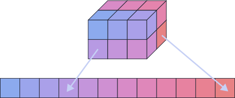
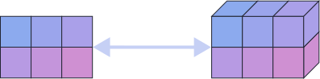
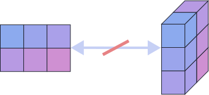
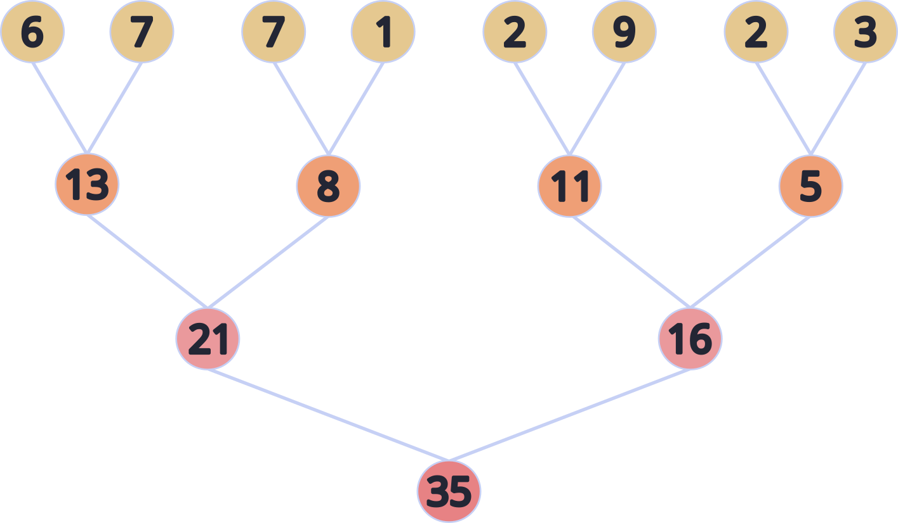
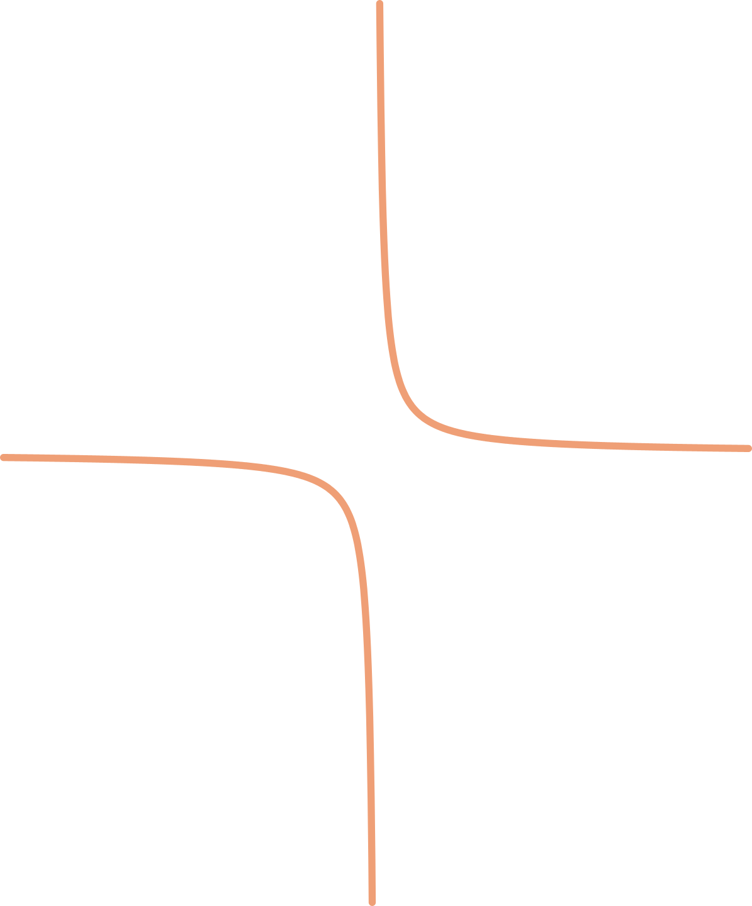
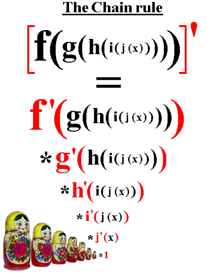
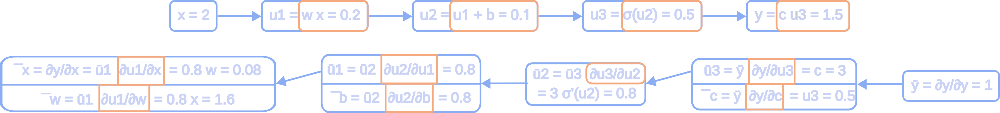
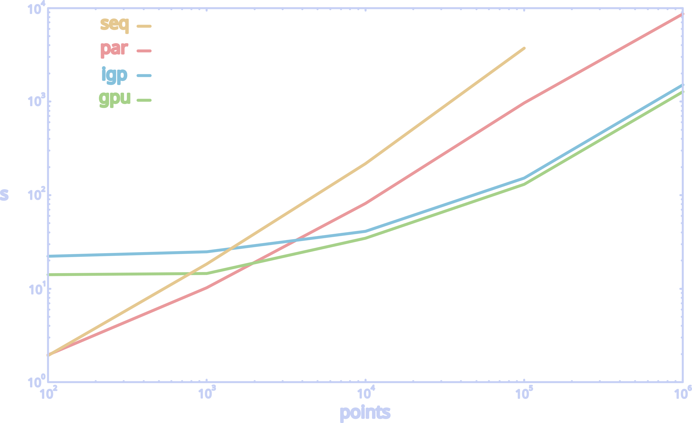
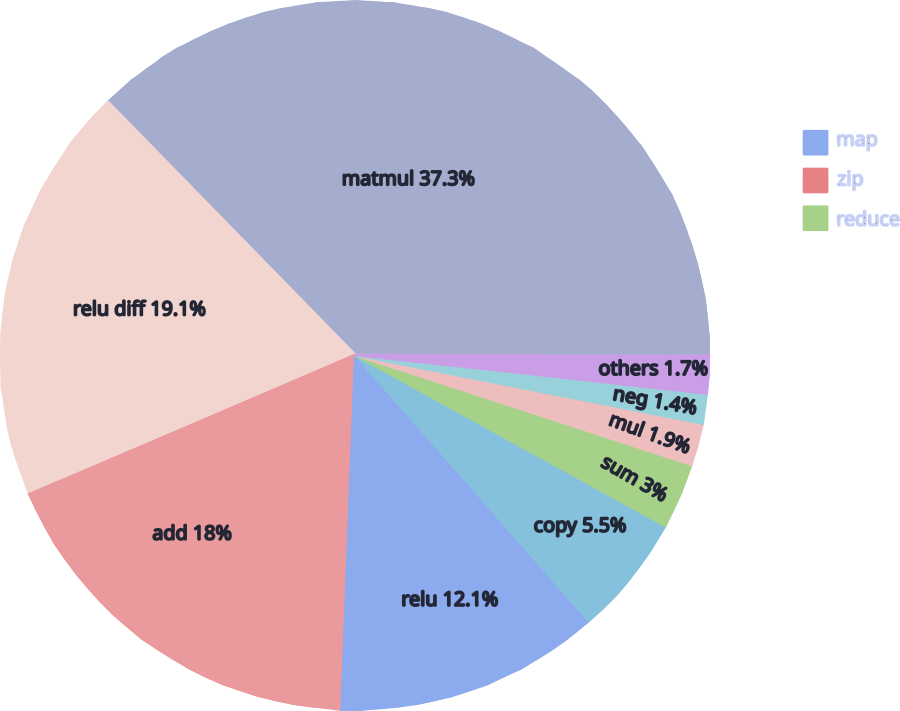

---
theme:
  name: catppuccin-macchiato
  override:
    default:
      margin:
        percent: 1
    slide_title:
      padding_top: 0
    bold:
      colors:
        foreground: red
    italics:
      colors:
        foreground: blue
    column_layout:
      margin:
        fixed: 4
    typst:
      colors:
        background: cad3f500
        foreground: cad3f5
      horizontal_margin: 0
      vertical_margin: 4
    footer:
      style: template
      #left:
      #  image: img/logo.png
      #center: '**allumette**'
      right: "{current_slide} / {total_slides}"
      height: 1
    code:
      padding:
        vertical: 0
        horizontal: 0
      minimum_margin:
        percent: 0
options:
  end_slide_shorthand: true
---

<!---
built with https://github.com/mfontanini/presenterm
-->

<!-- newlines: 12 -->

<!-- column_layout: [1, 3] -->

<!-- column: 0 -->


<!-- column: 1 -->
<!-- newlines: 1 -->

<span style="color: #ed8796">**allumette**</span>

<span style="color: #f5a97f">a tensor library written in Rust</span>

<span style="color: #eed49f">Ben Fradet</span>

<!-- no_footer -->

<!--
speaker_note: |
  3 goals when I started more than a year ago:
  - be a better Rust programmer
  - learn about GPU programming
  - understand tensors and nns fully
-->

---

Summary
===

<!-- newlines: 5 -->
# Tensors
# Neural networks
# Demo
# Benchmarks
# Profiling

---

What's a tensor?
===

if you recall your algebra classes...
<!-- newlines: 1 -->

<!-- alignment: center -->
credit: Cmglee, GNU FDL

<!-- newlines: 1 -->
<!-- alignment: center -->
multi-dimensional array of arbitrary dimensions

<!--
speaker_note: algebra to abstract over all algebras
-->

---

What does a tensor look like in rust?
===

```typst +render +width:30%
#set table(
  stroke: none,
  inset: -1pt,
)

#let cell(angle: 170deg, dx: 0em, dy: 0em) = {
  stack(
    box(width: 100%, height: 100%),

    place(
      dx: dx,
      dy: dy,
      align(
        center,
        rotate(angle, line(length: 90%, stroke: (dash: "dashed", paint: rgb("#5b6078")))),
      ),
    )
  )
}

#scale(
  75%,
  table(
    columns: 2,
    //[], [], [#cell()], [$mat(delim: "[", 41, 42; 43, 44)$],
    //[], [#cell()], [$mat(delim: "[", 31, 32; 33, 34)$], [#cell(dy: 1em, angle: 170deg)],
    [#cell(dx: 0.5em)], [$mat(delim: "[", 21, 22, 23; 24, 25, 26)$],
    [$mat(delim: "[", 11, 12, 13; 14, 15, 16)$], [#cell(dy: 1em)]
  )
)
```
<!-- newlines: 1 -->
<!-- pause -->

<!-- column_layout: [1, 1] -->

<!-- column: 0 -->
```rust +no_background
struct Tensor {
    data: Vec<f64>,
    shape: Shape,
    strides: Strides,
}
```
<!-- pause -->

<!-- column: 1 -->
```rust +no_background
let data = vec![
    11., 12., 13., 14., 15, 16,
    21., 22., 23., 24., 25, 26,
];
```
<!-- pause -->

<!-- column: 0 -->
```rust +no_background
struct Shape { data: Vec<usize> }
```
<!-- pause -->

<!-- column: 1 -->
```rust +no_background
// row major
let shape = Shape::new(vec![2, 2, 3]);
```
<!-- pause -->

<!-- column: 0 -->
```rust +no_background
struct Strides { data: Vec<usize> }
```
<!-- pause -->

<!-- column: 1 -->
```rust +no_background
let strides = Strides::new(vec![6, 3, 1]);
```
<!-- pause -->

<!-- column: 0 -->

<!-- column: 1 -->
<!-- newlines: 1 -->
```rust +no_background
tensor[0][1][0] = data[3]
tensor[1][1][2] = data[11]
tensor[i][j][k] = data[i * si + j * sj + k * sk]
```
how many elems to skip to advance one step along that dim

<!-- pause -->
transposition (permutation):  
`Shape([2, 3]) => Shape([3, 2])`  
adding / removing "empty" dimensions (viewing):  
`Shape([1, 2, 3]) <=> Shape([2, 3])`
<!-- column: 0 -->
<!-- newlines: 2 -->

<!-- column: 1 -->
_=> only require metadata changes_

<!--
speaker_note: |
  usually represented as 1-D arrays
  strides:
  - user-land index <=> 1-D index
  - can be derived from shape with a cum prod from the right
  3rd dim: layer
-->

---

Summary
===

<!-- newlines: 5 -->
# Tensors
## What's a tensor?
## What can we do with a tensor?

---

What can be done with a tensor?
===

<!-- newlines: 3 -->
<!-- column_layout: [3, 2] -->

<!-- column: 0 -->
```rust +no_background
trait Ops<E: Element> {

    fn map<F: Fn(E) -> E>(&self, f: F) -> Self;
```
<!-- pause -->

<!-- column: 1 -->
<!-- newlines: 1 -->
```typst +render +width:80%
$\{\ln(x), e^x, -x, frac(1, x), ...\}$
```
<!-- pause -->

<!-- column: 0 -->
```rust +no_background

    fn zip<F: Fn(E, E) -> E>(
        &self, other: &Self, f: F
    ) -> Option<Self>;
```
<!-- pause -->

<!-- column: 1 -->
```typst +render +width:80%
$\{x + y, x times y, x == y, ...\}$
```
<!-- pause -->

<!-- column: 0 -->
```rust +no_background

    fn reduce<F: Fn(E, E) -> E>(
        &self,
        f: F,
        dim: usize,
        zero: E,
    ) -> Option<Self>;
```
<!-- pause -->

<!-- column: 1 -->
<!-- newlines: 2 -->
```typst +render +width:80%
$\{sum(x), product(x)\}$
```
<!-- pause -->

<!-- column: 0 -->
```rust +no_background

    fn matmul(
        &self, other: &Self
    ) -> Option<Self>;

}
```

<!--
speaker_note: |
  Element abstract over f32, f64, etc
  zip: tensors can have incompatible shapes => none
  red: we're reducing along 1 dim of our tensor
  matmul: we also need to have compat shapes
-->

---

Map - cpu sequential
===

<!-- newlines: 6 -->
```rust +no_background +line_numbers
fn map<F: Fn(f64) -> f64>(
    &self, f: F
) -> Self {
    let out: Vec<_> = self.data
        .iter()
        .map(|d| f(*d))
        .collect();
    Self {
        data: out,
        shape: self.shape.clone(),
        strides: self.strides.clone(),
    }
}
```

<!-- speaker_note: we're constraining Element to be f64 for CPU -->

---

Map - cpu in parallel using rayon
===

<!-- newlines: 4 -->
<!-- column_layout: [1, 1] -->

<!-- column: 0 -->
```rust +no_background +line_numbers
fn map<F: Fn(f64) -> f64 + Sync>(
    &self, f: F
) -> Self {
    let out: Vec<_> = self.data
        .par_iter()
        .map(|d| f(*d))
        .collect();
    Self {
        data: out,
        shape: self.shape.clone(),
        strides: self.strides.clone(),
    }
}
```
<!-- pause -->

<!-- column: 1 -->
```rust +no_background +line_numbers
fn map<F: Fn(f64) -> f64>(
    &self, f: F
) -> Self {
    let out: Vec<_> = self.data
        .iter()
        .map(|d| f(*d))
        .collect();
    Self {
        data: out,
        shape: self.shape.clone(),
        strides: self.strides.clone(),
    }
}
```
<!-- reset_layout -->
<!-- alignment: center -->
<!-- newlines: 2 -->
<!-- pause -->
`Sync` => safe to share references between threads

[](github.com/rayon-rs/rayon)

<!--
speaker_note: |
  side by side comparison shows the par version is even more elegant
  par iterators dynamically adapt for max perf
-->

---

Map - gpu using wgpu and wgsl
===

<!-- pause -->
_WebGPU_: cross platform API sitting on top of Vulkan (Linux), Metal (Apple) or Direct3D (Windows)
<!-- pause -->
_WGSL_: WebGPU shader language, similar to Rust
<!-- pause -->
_wgpu_: Rust implementation of WebGPU used in Firefox and Deno

<!-- column_layout: [1, 1]-->

<!-- column: 0 -->
<!-- pause -->
<!-- newlines: 1 -->
```rust +no_background +line_numbers
@group(0) @binding(0)
var<storage, read> input: array<f32>;
@group(0) @binding(1)
var<storage, read_write> output: array<f32>;

fn neg(in: f32) -> f32 {
    return -in;
} // etc.

@compute
@workgroup_size(x, y, z)
fn call(
    @builtin(global_invocation_id) id: vec3<u32>
) {
    let i = id.x;
    output[i] = replace_me(input[i]);
}
```

<!-- column: 1 -->
<!-- newlines: 1 -->
<!-- pause -->
buffers living in GPU memory bound from the CPU side  
GPU doesn't allocate its own memory
<!-- pause -->
<!-- newlines: 5 -->
this is a compute shader as opposed to a graphics one
<!-- pause -->
how many threads run together as a work group, templated
<!-- pause -->
each thread gets a unique id (SIMT), thread 0 acts on `input[0]`
<!-- pause -->
template trick: GPU shader compilation happens at runtime

<!-- reset_layout -->
<!-- pause -->
<!-- newlines: 1 -->
<!-- alignment: center -->
_implicit parallelism_: there is no loop,
the "loop" is the CPU saying launch `N` threads each running `call`

[](github.com/gfx-rs/wgpu)

<!--
speaker_note: |
  cpu sets up buffers, gpu works on them
  binding: how the gpu knows which buffer goes where
  single instruction multiple threads
  template: one shader file per op, not per fn
  fundamental mental shift compared to cpu
-->

---

Map - orchestrating gpu code on the cpu
===

<!-- column_layout: [1, 1] -->
<!-- column: 0 -->
```rust +no_background +line_numbers
fn map(&self, f: &'static str) -> Self {
    let output_buffer = create_buffer(
        self.shape.gpu_byte_size());
    
    let wg = (&self.shape).into();

    let pipeline = get_or_create_pipeline(
        f,
        wg.size,
    );

    let bind_group = create_bind_group(
        &[&self.buffer, &output_buffer],
        &pipeline.get_bind_group_layout(0),
    );

    let command = enqueue_command(
        &pipeline,
        &bind_group,
        &wg.count, 
    );

    Self {
        buffer: output_buffer,
        shape: self.shape.clone(),
        strides: self.strides.clone(),
        context: self.context,
    }
}
```

<!-- column: 1 -->
<!-- pause -->
not a function anymore just a tag
<!-- pause -->
`sizeof(f32) * tensor size`
<!-- pause -->
work group counts and sizes
<!-- pause -->
compute pipeline: compiled shader + bind group layout info  
cached by templated info: `f` and `wg.size`
<!-- pause -->
<!-- newlines: 2 -->
which buffer goes where in the compiled shader
<!-- pause -->
<!-- newlines: 3 -->
compute command: pipeline + bind group + dispatch info
<!-- pause -->
_lazy_
<!-- newlines: 2 -->
<!-- pause -->
```rust +no_background
struct GpuTensor<'a> {
    buffer: Buffer,
    shape: Shape,
    strides: Strides,
    context: &'a WgpuContext,
}
```

<!--
speaker_note:|
  not a fn anymore, only a tag to be templated in
  more about wgs in the next slides
  dispatch info: cpu telling gpu how many wgs to run
-->

---

Map - gpu parallelism
===

<!-- alignment: center -->
workgroups are collections of threads that execute together and share local memory
<!-- pause -->

<!-- column_layout: [1, 1] -->

<!-- column: 0 -->

<!-- alignment: center -->
credit: CubeCL, Apache 2.0
<!-- pause -->

<!-- column: 1 -->
identifiers
```typst +render +width:100%
$
vec("global_inv_id"_x, "global_inv_id"_y, "global_inv_id"_z) =
    vec(
        "wg_size"_x times "wg_id"_x + "local_inv_id"_x,
        "wg_size"_y times "wg_id"_y + "local_inv_id"_y,
        "wg_size"_z times "wg_id"_z + "local_inv_id"_z
    )
$
```
<!-- pause -->
total invocations
```typst +render +width:60%
$vec("wg_size"_x, "wg_size"_y, "wg_size"_z) dot vec("num_wgs"_x, "num_wgs"_y, "num_wgs"_z)$
```
<!-- pause -->

<!-- column: 0 -->
<!-- newlines: 2 -->
```rust +no_background +line_numbers
@compute
@workgroup_size(wg_size_x, wg_size_y, wg_size_z)
fn call(@builtin(global_invocation_id)
    id: vec3<u32>
) {
    // (id.x, id.y, id.z) unique thread id
    let i = id.x; 
    output[i] = input[i];
}
```
<!-- pause -->

<!-- column: 1 -->
<!-- newlines: 5 -->
```rust +no_background
// inside enqueue_command
let mut pass = encoder.begin_compute_pass();
pass.dispatch_workgroups(num_wgs_x, num_wgs_y, num_wgs_z);
```

<!--
speaker_note: |
  two levers for parallelism: wg sizes and counts
  unique thread id lets us know where we are in the tensor
  you can think of it as an office building
  counts: how many offices there are in the building
  sizes: how many workers are actually doing work within each offices
-->

---

Map - gpu parallelism cont'd
===

<!-- column_layout: [1, 1] -->

<!-- column: 1 -->
```rust +no_background
struct WorkgroupInfo {
    count: (usize, usize, usize),
    size: (usize, usize, usize),
}
```
<!-- pause -->
why don't we stuff everything in wg size?
<!-- pause -->
```typst +render +width:70%
$"wg_size"_x times "wg_size"_y times "wg_size"_z <= 256$
```
<!-- pause -->
<!-- column: 0 -->
```rust +no_background +line_numbers
const MAX_WG_SIZE: usize = 256;
fn from(shape: &Shape) -> Self {
    let size = shape.size;
    if size <= MAX_WG_SIZE {
        WorkgroupInfo {
            count: (1, 1, 1),
            size: (size.next_power_of_two(), 1, 1),
        }
    } else {
        let count = size.div_ceil(MAX_WG_SIZE);
        WorkgroupInfo {
            count: WorkgroupInfo::chunk(count),
            size: (MAX_WG_SIZE, 1, 1),
        }
    }
}
```
<!-- column: 1 -->
<!-- pause -->
we have 1D data so we only leverage `wg_size x`
<!-- pause -->
gpus execute threads in _warps_ or _wavefronts_ of `32` or `64`, hence `next_power_of_two`

<!-- column: 0 -->
<!-- pause -->
```rust +no_background +line_numbers
const MAX_WG_CNT: usize = 65535;
fn chunk(count: usize) -> (usize, usize, usize) {
    if count <= MAX_WG_CNT {
        (count, 1, 1)
    } else if count <= MAX_WG_CNT * MAX_WG_CNT {
        let y = count.div_ceil(MAX_WG_CNT);
        (MAX_WG_CNT, y, 1)
    } else {
        let z = count.div_ceil(MAX_WG_CNT * MAX_WG_CNT);
        (MAX_WG_CNT, MAX_WG_CNT, z)
    }
}
```

<!-- column: 1 -->
<!-- newlines: 2 -->
<!-- pause -->
```typst +render +width:45%
$"shape" = [10^6, 256, 2]$
```
<!-- pause -->
```typst +render +width:40%
$"size" = 512 times 10^6$
```
<!-- pause -->
```typst +render +width:80%
$"wg size" = vec(256, 1, 1), "wg count" = vec(65535, 31, 1)$
```
<!-- pause -->
workgroups are here to hide memory latency: while a workgroup waits on a memory fetch, another runs

<!--
speaker_note: |
  you might be thinking why don't we just stuff everything in wg size
  max wg size is hardware limit across all dims: 256 for webgpu, 1024 for cuda
  max wg count is per dim
-->

---

Summary
===

<!-- newlines: 5 -->
# Tensors
## What's a tensor?
## What can we do with a tensor?
### Map
### Zip

---

Zip - broadcasting
===

<!-- alignment: center -->
...you'll remember there are rules for element-wise operations...
<!-- pause -->
<!-- newlines: 1 -->

<!-- alignment: center -->
```typst +render +width:25%
$
1
+
underbrace(
  mat(
    1, ..., 2;
    dots.v, dots.down, dots.v;
    3, ..., 4;
  ),
  n,
) lr(size: #3em, brace.r) m
=
underbrace(
  mat(
    2, ..., 3;
    dots.v, dots.down, dots.v;
    4, ..., 5;
  ),
  n,
) lr(size: #3em, brace.r) m
$
```
<!-- pause -->
```typst +render +width:35%
$
m lr(size: #3em, brace.l) vec(
  1, dots.v, 2
) 
+
underbrace(
  mat(
    1, ..., 2;
    dots.v, dots.down, dots.v;
    3, ..., 4;
  ),
  n,
) lr(size: #3em, brace.r) m
=
underbrace(
  mat(
   2, ..., 3;
   dots.v, dots.down, dots.v;
   5, ..., 6;
  ),
  n,
) lr(size: #3em, brace.r) m
$
```
<!-- pause -->
```typst +render +width:35%
$
underbrace(
  (1 ... 2),
  n
) 
+
underbrace(
  mat(
    1, ..., 2;
    dots.v, dots.down, dots.v;
    3, ..., 4;
  ),
  n,
) lr(size: #3em, brace.r) m
=
underbrace(
  mat(
   2, ..., 4;
   dots.v, dots.down, dots.v;
   4, ..., 6;
  ),
  n,
) lr(size: #3em, brace.r) m
$
```
<!-- pause -->
```typst +render +width:100%
$
m lr(size: #3em, brace.l) underbrace(
  mat(
    1, ..., 2;
    dots.v, dots.down, dots.v;
    3, ..., 4;
  ),
  n,
) 
+
underbrace(
  mat(
    1, ..., 2;
    dots.v, dots.down, dots.v;
    3, ..., 4;
  ),
  n,
) lr(size: #3em, brace.r) m
=
underbrace(
  mat(
   2, ..., 4;
   dots.v, dots.down, dots.v;
   6, ..., 8;
  ),
  n,
) lr(size: #3em, brace.r) m
$
```

---

Zip - broadcasting cont'd
===

<!-- column_layout: [6, 4] -->

<!-- column: 0 -->
<!-- newlines: 3 -->
```rust +no_background +line_numbers
fn broadcast(&self, b: &Shape) -> Option<Shape> {
    let (n, m) = (self.len(), b.len());
    let max = m.max(n);

    let mut out = Vec::with_capacity(max);

    for i in (0..max).rev() {
        let ai = if i < n { self[n - 1 - i] } else { 1 };
        let bi = if i < m { b[m - 1 - i] } else { 1 };

        match (ai, bi) {
            (1, b) => out.push(b),
            (a, 1) => out.push(a),
            (a, b) if a == b => out.push(s),
            _ => return None,
        }
    }

    Some(Shape::new(out))
}
```
<!-- pause -->

<!-- column: 1 -->

<!-- pause -->

<!-- pause -->
```typst +render +width:50%
#grid(
  columns: (auto, auto, auto),
  align: (right + horizon, center + horizon, left + horizon),
  row-gutter: 0.5em,
  $mat(delim: "(", 1)$,
  grid.cell(rowspan: 2, align: center + horizon, $#h(0.5em)=#h(0.5em)$),
  grid.cell(rowspan: 2, align: left + horizon, $mat(delim: "(", 2, 3)$),
  $mat(delim: "(", 2, 3)$,
)
```
<!-- pause -->
```typst +render +width:50%
#grid(
  columns: (auto, auto, auto),
  align: (right + horizon, center + horizon, left + horizon),
  row-gutter: 0.5em,
  $mat(delim: "(", 5)$,
  grid.cell(rowspan: 2, align: center + horizon, $#h(0.5em)=#h(0.5em)$),
  grid.cell(rowspan: 2, align: left + horizon, $mat(delim: "(", 2, 5)$),
  $mat(delim: "(", 2, 5)$,
)
```
<!-- pause -->
```typst +render +width:60%
#grid(
  columns: (auto, auto, auto),
  align: (right + horizon, center + horizon, left + horizon),
  row-gutter: 0.5em,
  $mat(delim: "(", 2, 3, 1)$,
  grid.cell(rowspan: 2, align: center + horizon, $#h(0.5em)=#h(0.5em)$),
  grid.cell(rowspan: 2, align: left + horizon, $mat(delim: "(", 7, 2, 3, 5)$),
  $mat(delim: "(", 7, 2, 3, 5)$,
)
```
<!-- column_layout: [1, 1, 1] -->
<!-- column: 1 -->
<!-- pause -->
```typst +render +width:100%
#grid(
  columns: (auto, auto),
  align: (right + horizon, center + horizon),
  row-gutter: 0.5em,
  $mat(delim: "(", 5, 2)$,
  grid.cell(
    rowspan: 2,
    align: center + horizon,
    [\= #text(fill: red)[None]],
  ),
  $mat(delim: "(", 5)$,
)
```
<!-- column: 2 -->
<!-- pause -->
```typst +render +width:70%
#grid(
  columns: (auto, auto),
  align: (right + horizon, center + horizon),
  row-gutter: 0.5em,
  $mat(delim: "(", 5, 7, 5, 1)$,
  grid.cell(
    rowspan: 2,
    align: center + horizon,
    [\= #text(fill: red)[None]],
  ),
  $mat(delim: "(", 1, 5, 1, 5)$,
)
```

<!--
speaker_note: |
  we can pad left a shape with 1s (empty dimensions), aka viewing
  anything takes priority over 1
-->

---

Zip - impl
===

<!-- column_layout: [1, 1] -->

<!-- column: 0 -->
<!-- newlines: 5 -->
```rust +no_background
fn zip(&self, b: &Self, f: &'static str) -> Option<Self> {
    let c_shape = if self.shape == b.shape {
        self.shape.clone()
    } else {
        self.shape.broadcast(&b.shape)?
    };
    let c_strides: Strides = (&c_shape).into();
    // same ceremony: buffer, pipeline, command
```
<!-- pause -->
<!-- newlines: 1 -->
```rust +no_background +line_numbers
@compute @workgroup_size(x, y, z)
fn zip(@builtin(global_invocation_id) id: vec3<u32>) {
    let i = id.x;

    let c_idx = to_idx(i, c_shape);

    let a_idx = bc_idx(c_idx, a_shape);
    let b_idx = bc_idx(c_idx, b_shape);

    let a_pos = dotp(a_idx, a_strides);
    let b_pos = dotp(b_idx, b_strides);
    let c_pos = dotp(c_idx, c_strides);

    c[c_pos] = op(a[a_pos], b[b_pos]);
}
```

<!-- column: 1 -->
<!-- pause -->
```typst +render +width:100%
$
    C = A + B =
    1 lr(size: #1em, brace.l) underbrace((1 #h(0.5em) 2), 2) +
    underbrace(vec(3, 4), 1) lr(size: #2em, brace.r) 2 =
    mat(4, 5; 5, 6)
$
```
<!-- pause -->
```rust +no_background
a_shape = [1, 2], a_strides = [2, 1]
b_shape = [2, 1], b_strides = [1, 1]
c_shape = [1, 2].bc([2, 1]) = [2, 2], c_strides = [2, 1]
```
<!-- newlines: 5 -->
<!-- pause -->
```rust +no_background
i = 3
// converts 1D indices to nD using the output shape
to_idx(3, [2, 2]) = [1, 1] // 3 / 2 => 3 % 2
```
<!-- pause -->
```rust +no_background
// maps c_idx back to each shape, if 1 => 0 else c_idx
a_idx = bc_idx([1, 1], [1, 2]) = [0, 1]
b_idx = bc_idx([1, 1], [2, 1]) = [1, 0]
```
<!-- pause -->
```rust +no_background
// converts nD back to 1D using strides
a_pos = dotp([0, 1], [2, 1]) = 1
b_pos = dotp([1, 0], [1, 1]) = 1
c_pos = dotp([1, 1], [2, 1]) = 2 + 1 = 3
```
<!-- pause -->
```rust +no_background
c[3] = a[1] + b[1] = 2 + 4 = 6
```

<!-- speaker_note: tbd -->

---
<!-- skip_slide -->
Zip - impl
===

<!-- column_layout: [1, 1] -->

<!-- column: 0 -->
```rust +no_background +line_numbers
fn zip<F: Fn(f64, f64) -> f64>(
    &self,
    other: &Self,
    f: F
) -> Option<Self> {
    let shape = if self.shape == other.shape {
        self.shape.clone()
    } else {
        self.shape.broadcast(&other.shape)?
    };
    let strides: Strides = (&shape).into();

    let mut out = vec![0.; shape.size];

    for i in 0..shape.size {
        let idx = strides.idx(i);
        let idxa = idx.broadcast(&self.shape);
        let idxb = idx.broadcast(&other.shape);
        let posa = self.strides.position(&idxa);
        let posb = other.strides.position(&idxb);
        let va = self.data[posa];
        let vb = other.data[posb];
        let pos = strides.position(&idx);
        out[pos] = f(va, vb);
    }

    Some(Self::new(out, shape, strides))
}
```
<!-- pause -->

<!-- column: 1 -->
```typst +render +width:75%
$
    1 lr(size: #1em, brace.l) underbrace((1 #h(0.5em) 2), 2) +
    underbrace(vec(3, 4), 1) lr(size: #2em, brace.r) 2 =
    mat(4, 5; 5, 6)
$
```
<!-- pause -->
```rust +no_background
[2, 2]
```
<!-- pause -->
```rust +no_background
[2, 1]
```
<!-- pause -->
```rust +no_background
out = [0, 0, 0, 0]
```
<!-- pause -->
```rust +no_background
i = 3
idx = [1, 1]  // 1D => nD: 3 / 2 => (3 % 2) / 1
idxa = [0, 1] // [1, 1] bc [1, 2]
idxb = [1, 0] // [1, 1] bc [2, 1]
posa = 1      // nD => 1D: [1, 2] pos [0, 1]
posb = 1      // nD => 1D: [2, 1] pos [1, 0]
va = 2
vb = 4
pos = 3       // nD => 1D: [2, 1] pos [1, 1]
out[3] = 2 + 4 = 6
```

---

Summary
===

<!-- newlines: 5 -->
# Tensors
## What's a tensor?
## What can we do with a tensor?
### Map
### Zip
### Reduce

---

Reduce
===

<!-- newlines: 3 -->
<!-- column_layout: [1, 1] -->

<!-- column: 0 -->
```typst +render +width:60%
$
    sum_(d=0) mat(1, 2, 3; 4, 5, 6) = #h(0.5em) ?
$
```
<!-- pause -->
```typst +render +width:30%
$
    (5 #h(0.5em) 7 #h(0.5em) 9)
$
```
<!-- pause -->

<!-- column: 1 -->
```typst +render +width:60%
$
    sum_(d=1) mat(1, 2, 3; 4, 5, 6) = #h(0.5em) ?
$
```
<!-- pause -->
```typst +render +width:20%
$
    vec(6, 15)
$
```

<!-- reset_layout -->
<!-- alignment: center -->
<!-- pause -->
```rust +no_background
fn red(&self, dim: usize, zero: f32, f: &'static str) -> Option<Self> {
    if dim >= self.shape.data().len() {
        None
    } else {
        let mut shape_data = self.shape.data().to_vec();
        shape_data[dim] = 1;
        let shape = Shape::new(shape_data);
        let strides = (&shape).into();
        // same ceremony: buffer, pipeline, command
```

---
<!-- skip_slide -->

Reduce - impl
===

<!-- column_layout: [1, 1] -->

<!-- column: 0 -->
```rust +no_background +line_numbers
fn reduce<F: Fn(f64, f64) -> f64>(
    &self,
    f: F,
    dim: usize,
    zero: f64,
) -> Self {
    let mut shape_data = self.shape.to_vec();
    shape_data[dim] = 1;
    let shape = Shape::new(shape_data);
    let strides: Strides = (&shape).into();

    let len = shape.size;
    let mut out = vec![zero; len];

    for i in 0..len {
        let mut idx = strides.idx(i);
        let out_pos = strides.position(&idx);
        for j in 0..self.shape[dim] {
            idx[dim] = j;
            let pos = self.strides.position(&idx);
            let v_self = self.data[pos];
            out[out_pos] = f(out[out_pos], v_self);
        }
    }
    Self::new(out, shape, strides)
}
```

<!-- pause -->

<!-- column: 1 -->
```typst +render +width:55%
$
    product_(d=1) mat(1, 2, 3; 4, 5, 6; 7, 8, 9) = vec(6, 120, 504)
$
```
<!-- pause -->
```rust +no_background
[3, 1]
[1, 1]
```
<!-- pause -->
<!-- newlines: 1 -->
```rust +no_background
out = [1, 1, 1]
```
<!-- pause -->
```rust +no_background
i = 2
idx = [2, 0]      // 1D => nD: 2 / 1 => (2 % 1) / 1
out_pos = 2       // [1, 1] pos [2, 0]
j = {0, 1, 2}
idx = {[2, 0], [2, 1], [2, 2]}
pos = {6, 7, 8}   // nD => 1D: [3, 1] pos idx
v_self = {7, 8, 9}
out[2] = {1 * 7, 7 * 8, 56 * 9}
```

---

Reduce - gpu impl
===

<!-- column_layout: [3, 4] -->

<!-- column: 0 -->
```rust +no_background +line_numbers
var<workgroup> shared: array<f32, WG_SIZE>;

@compute @workgroup_size(WG_SIZE, 1, 1)
fn reduce(local_id: u32, wg_id: u32) {
    var acc = default;
    for (
        var k = local_id;
        k < red_dim_size;
        k += WG_SIZE
    ) {
        acc = op(acc, input[index(wg_id, k)]);
    }
    shared[local_id] = acc;
    workgroupBarrier();

    for (var s = WG_SIZE / 2; s > 0; s /= 2) {
        if (local_id < s) {
            shared[local_id] = op(
                shared[local_id],
                shared[local_id + s]
            );
        }
        workgroupBarrier();
    }

    if (local_id == 0) {
        output[wg_id] = shared[0];
    }
}
```

<!-- column: 1 -->
<!-- pause -->
shared mem of `WG_SIZE = min(256, red_dim_size.next_power_of_two())`  
We dispatch one wg per reduced / output element
<!-- newlines: 2 -->
<!-- pause -->
_Phase 1_: 
  - `WG_SIZE` threads split the reduce dim
  - each thread handles every `WG_SIZE`th elem
<!-- newlines: 3 -->
<!-- pause -->
_Phase 2_: striding parallel tree reduction in shared memory

<!-- pause -->
_Phase 3_: thread 0 writes the final result
<!-- pause -->
presentation by Mark Harris: [](developer.download.nvidia.com/assets/cuda/files/reduction.pdf)

<!--
speaker_note: |
  shared mem within a wg
  wg size is templated as before
  wg barrier: all threads within a wg waits until they all reach that point
  avoid data race for the shared memory
  2nd wg barrier: we mutate shared memory to the left
-->

---

Reduce - gpu impl cont'd
===

<!-- column_layout: [1, 1] -->

<!-- column: 1 -->
```typst +render +width:70%
$
product_(d=1) mat(1, 2, 3; 4, 5, 6; 7, 8, 9) = vec(6, 120, 504) \
"red_dim_size" = 3, #h(0.5em) "WG_SIZE" = 4, #h(0.5em)  "wg" "cnt" = 3
$
```
<!-- column: 0 -->
<!-- pause -->
```rust +no_background +line_numbers
var<workgroup> shared: array<f32, WG_SIZE>;

@compute @workgroup_size(WG_SIZE, 1, 1)
fn reduce(local_id: u32, wg_id: u32) {
    var acc = 1.0;
    for (
        var k = local_id;
        k < red_dim_size;
        k += WG_SIZE;
    ) {
        acc = acc * input[index(wg_id, k)];
    }
    shared[local_id] = acc;
    workgroupBarrier();

    for (var s = WG_SIZE / 2; s > 0; s /= 2) {
        if (local_id < s) {
            shared[local_id] =
                shared[local_id] *
                shared[local_id + s];
        }
        workgroupBarrier();
    }

    if (local_id == 0) {
        output[wg_id] = shared[0];
    }
}
```
<!-- column: 1 -->
<!-- pause -->
```typst +render +width:30%
wg 0: \
$
"shared" = [1, 2, 3, 1] \
(1 times 3) times (2 times 1) = 6
$
```
```typst +render +width:75%
wg 1: \
$
t_0: #h(0.5em) k = 0 -> A[1, 0], #h(0.5em) "acc" = 1. times 4 = 4 \
t_1: #h(0.5em) k = 1 -> A[1, 1], #h(0.5em) "acc" = 1. times 5 = 5 \ 
t_2: #h(0.5em) k = 2 -> A[1, 2], #h(0.5em) "acc" = 1. times 6 = 6 \ 
"phase 1: shared" = [4, 5, 6, 1] \
"phase 2: "(4 times 6) times (5 times 1) = 120
$
```
```typst +render +width:30%
wg 2: \
$
"shared" = [7, 8, 9, 1] \
(7 times 9) times (8 times 1) = 504
$
```

---


Summary
===

<!-- newlines: 5 -->
# Tensors
## What's a tensor?
## What can we do with a tensor?
### Map
### Zip
### Reduce
### Matmul

---

Matmul
===

<!-- alignment: center -->
...you'll also remember there are rules for matrix multiplication...


```typst +render +width:60%
#let hlp(x) = text(fill: rgb("#f5a97f"))[$#x$]
#let hlm(x) = text(fill: rgb("#c6a0f6"))[$#x$]

#let hll(x) = {
  set text(fill: gradient.linear(rgb("#c6a0f6"), rgb("#f5a97f")))
  box($#x$)
}
#let hlr(x) = {
  set text(fill: gradient.linear(rgb("#f5a97f"), rgb("#c6a0f6")))
  box($#x$)
}

#grid(
  columns: 2,
  column-gutter: 0.5em,
  row-gutter: 0.3em,
  align: (right + bottom, left + bottom),
  [],
  $ n lr(size: #3em, brace.l) overbrace(mat(hlm(1), hlp(2); hlm(3), hlp(4); hlm(5), hlp(6)), p) $,
  $ C = A B = mat(hlm(1), hlm(2), hlm(3); hlp(4), hlp(5), hlp(6)) mat(hlm(1), hlp(2); hlm(3), hlp(4); hlm(5), hlp(6)) =
        mat(hlm(22), hll(28); hlr(49), hlp(64)) #h(1em) => #h(1em)
        m lr(size: #2em, brace.l) underbrace(mat(hlm(1), hlm(2), hlm(3); hlp(4), hlp(5), hlp(6)), n) $,
  $ m lr(size: #2em, brace.l) underbrace(mat(hlm(22), hll(28); hlr(49), hlp(64)), p) $,
)
```

<!-- newlines: 1 -->
<!-- pause -->
```rust +no_background +line_numbers
fn matmul(&self, b: &Self) -> Option<Self> {
    let a_shape_len = self.shape.len();
    let b_shape_len = b.shape.len();
    (self.shape[a_shape_len - 1] == b.shape[b_shape_len - 2]).then_some(0)?;

    let a_shape = self.shape.clone().drop_right(2);
    let b_shape = other.shape.clone().drop_right(2);

    let mut shape = a_shape.broadcast(&b_shape)?;
    shape.push(self.shape[a_shape_len - 2]); // m
    shape.push(b.shape[b_shape_len - 1]); // p
    let strides = (&shape).into();
    // same ceremony: buffer, pipeline, command
```

---
<!-- skip_slide -->

Matmul - impl
===

<!-- column_layout: [1, 1] -->

<!-- column: 0 -->
<!-- newlines: 5 -->
```rust +no_background +line_numbers
fn matmul(&self, rhs: &Self) -> Option<Self> {
    let lhs_rank = self.shape.len();
    let rhs_rank = rhs.shape.len();
    
    let n1 = self.shape[lhs_rank - 1];
    let n2 = rhs.shape[rhs_rank - 2];
    (n1 == n2).then_some(())?;

    let m = self.shape[lhs_rank - 2];
    let p = rhs.shape[rhs_rank - 1];

    let lhs_shape = self.shape.drop_right(2);
    let rhs_shape = rhs.shape.drop_right(2);

    let mut shape =
        lhs_shape.broadcast(&rhs_shape)?;
    shape.push(m);
    shape.push(p);
    let len = shape.size;
    let strides: Strides = (&shape).into();

    let mut out = vec![0.; len];

    // to be continued ...
```

<!-- pause -->

<!-- column: 1 -->
```typst +render +width:90%
$
m lr(size: #2em, brace.l) underbrace(mat(1, 2, 3; 4, 5, 6), n)  times
underbrace(mat(1, 2; 3, 4; 5, 6), p) lr(size: #3em, brace.r) n =
underbrace(mat(22, 28; 49, 64), p) lr(size: #2em, brace.r) m
$
```

<!-- pause -->

```rust +no_background
n1 = 3 // nb cols A
n2 = 3 // nb rows B
```
<!-- pause -->
<!-- newlines: 1 -->
```rust +no_background
m = 2 // nb rows A
p = 2 // nb cols B
```
<!-- pause -->
<!-- newlines: 4 -->
```rust +no_background
[]
[2]
[2, 2]

[2, 1]
```
<!-- pause -->
```rust +no_background
[0, 0, 0, 0]
```

---
<!-- skip_slide -->

Matmul - impl cont'd
===

<!-- column_layout: [1, 1] -->

<!-- column: 0 -->
<!-- newlines: 5 -->
```rust +no_background +line_numbers
    // ... continuing

    for (i, out_i) in out.iter_mut().enumerate() {

        let idx = strides.idx(i);
        let mut lhs_idx = idx.broadcast(&self.shape);
        let mut rhs_idx = idx.broadcast(&rhs.shape);

        let mut tmp = 0.;
        for pos in 0..n {
            lhs_idx[lhs_rank - 1] = pos;
            rhs_idx[rhs_rank - 2] = pos;
            let lhs_pos =
                self.strides.position(&lhs_idx);
            let rhs_pos =
                rhs.strides.position(&rhs_idx);
            tmp +=
                self.data[lhs_pos] * rhs.data[rhs_pos];
        }
        *out_i = tmp;
    }

    Some(Self::new(out, shape, strides))
}
```

<!-- pause -->

<!-- column: 1 -->
```typst +render +width:70%
$
m lr(size: #2em, brace.l) underbrace(mat(1, 2, 3; 4, 5, 6), n)  times
underbrace(mat(1, 2; 3, 4; 5, 6), p) lr(size: #3em, brace.r) n =
underbrace(mat(22, 28; 49, 64), p) lr(size: #2em, brace.r) m
$
```

<!-- pause -->

```rust +no_background
i = 3
```
<!-- pause -->
```rust +no_background
idx = [1, 1] // [2, 1] idx 3, 3 / 2 => (3 % 2) / 1
lhs_idx = [1, 1] // [1, 1] bc [2, 3]
rhs_idx = [1, 1] // [1, 1] bc [3, 2]
```
<!-- pause -->
```rust +no_background

pos = {0, 1, 2}
lhs_idx = {[1, 0], [1, 1], [1, 2]}
rhs_idx = {[0, 1], [1, 1], [2, 1]}

lhs_pos = {3, 4, 5} // nD => 1D: [3, 1] pos lhs_idx
rhs_pos = {1, 3, 5} // nD => 1D: [2, 1] pos rhs_idx

tmp = {4 * 2, 8 + 5 * 4, 28 + 6 * 6} => 64
```

---

Matmul - gpu impl
===

<!-- column_layout: [5, 4] -->

<!-- column: 0 -->
```rust +no_background +line_numbers
var<workgroup> a_tile: array<array<f32, T>, T>;
var<workgroup> b_tile: array<array<f32, T>, T>;

@compute @workgroup_size(T, T, 1)
fn matmul(local_id: vec2<u32>, wg_id: vec2<u32>) {
    let lx = local_id.x;
    let ly = local_id.y;
    let tx = wg_id.x * T;
    let ty = wg_id.y * T;

    var acc = 0.0;
    for (var ti = 0u; ti < ceil(n / T); ti++) {
        a_tile[ly][lx] = a[ty + ly][ti * T + lx];

        b_tile[ly][lx] = b[ti * T + ly][tx + lx];

        workgroupBarrier();

        for (var k = 0u; k < T; k++) {
            acc = fma(
                a_tile[ly][k],
                b_tile[k][lx],
                acc
            );
        }
    }

    c[ty + ly][tx + lx] = acc;
}
```

<!-- column: 1 -->
<!-- pause -->
`T = 16` because `T x T = 256 = MAX_WG_SIZE`  
each wg loads `2 TxT` tiles into shared mem  
<!-- pause -->
2D wg sizes
<!-- pause -->
thread positions within tile
<!-- pause -->
tile positions in output grid
<!-- pause -->
<!-- newlines: 1 -->
thread `lx,ly` loads 1 elem from A and B for each tile
<!-- pause -->
row elem from A
<!-- pause -->
col elem from B
<!-- pause -->
<!-- newlines: 3 -->
each tile is loaded once but used `T` times  
by accumulating dot product from shared memory  

`fma`: fused multiply-add, one instruction
<!-- newlines: 1 -->
<!-- pause -->
blog post by Simon Boehm: [](siboehm.com/articles/22/CUDA-MMM)

blog post by Aleksa Gordić: [](www.aleksagordic.com/blog/matmul)

<!-- speaker_note: wg barrier again -->

---

Matmul - gpu impl cont'd
===

<!-- column_layout: [4, 3] -->

<!-- column: 0 -->
```rust +no_background +line_numbers
var<workgroup> a_tile: array<array<f32, T>, T>;
var<workgroup> b_tile: array<array<f32, T>, T>;

@compute @workgroup_size(T, T, 1)
fn matmul(local_id: vec2<u32>, wg_id: vec2<u32>) {
    let lx = local_id.x;
    let ly = local_id.y;
    let tx = wg_id.x * T;
    let ty = wg_id.y * T;

    var acc = 0.0;
    for (var tile = 0u; tile < ceil(n / T); tile++) {
        a_tile[ly][lx] = A[ty + ly][tile * T + lx];

        b_tile[ly][lx] = B[tile * T + ly][tx + lx];

        workgroupBarrier();

        for (var k = 0u; k < T; k++) {
            acc = fma(
                a_tile[ly][k],
                b_tile[k][lx],
                acc
            );
        }
    }

    C[ty + ly][tx + lx] = acc;
}
```

<!-- column: 1 -->
```typst +render +width:80%
$
m lr(size: #2em, brace.l) underbrace(mat(1, 2, 3; 4, 5, 6), n)  times
underbrace(mat(1, 2; 3, 4; 5, 6), p) lr(size: #3em, brace.r) n =
underbrace(mat(22, 28; 49, 64), p) lr(size: #2em, brace.r) m \
T = 2, #h(0.5em) n = 3
$
```
<!-- pause -->
```typst +render +width:70%
tile index = 0
$
underbrace(mat(1, 2; 4, 5), "a_tile") times underbrace(mat(1, 2; 3, 4), "b_tile") \
t_(0, 0): #h(0.5em) "fma"(1, 1, 0) #h(0.5em) -> #h(0.5em) "fma"(2, 3, 1) #h(0.5em) -> #h(0.5em) "acc" = 7 \
t_(1, 0): #h(0.5em) "fma"(1, 2, 0) #h(0.5em) -> #h(0.5em) "fma"(2, 4, 2) #h(0.5em) -> #h(0.5em) "acc" = 10 \
t_(0, 1): #h(0.5em) "fma"(4, 1, 0) #h(0.5em) -> #h(0.5em) "fma"(5, 3, 4) #h(0.5em) -> #h(0.5em) "acc" = 19 \
t_(1, 1): #h(0.5em) "fma"(4, 2, 0) #h(0.5em) -> #h(0.5em) "fma"(5, 4, 8) #h(0.5em) -> #h(0.5em) "acc" = 28
$
```
<!-- pause -->
```typst +render +width:60%
tile index = 1
$
underbrace(mat(3, 0; 6, 0), "a_tile") times underbrace(mat(5, 6; 0, 0), "b_tile") \
t_(0, 0): "fma"(3, 5, 7) -> "fma"(0, 0, 22) = 22 \
t_(1, 0): "fma"(3, 6, 10) -> "fma"(0, 0, 28) = 28 \
t_(0, 1): "fma"(6, 5, 19) -> "fma"(0, 0, 49) = 49 \
t_(1, 1): "fma"(6, 6, 28) -> "fma"(0, 0, 64) = 64 \
$
```

<!--
speaker_note: |
  t = 2 and not 16 to ease comprehension
  it's like putting a TxT mask over our matrices
  and we know we can matmul square matrices
  tile index = 1, we pad with 0s
-->

---

<!-- newlines: 6 -->
<!-- alignment: center -->
We now understand what a tensor is and what it does!


---

Summary
===

<!-- newlines: 5 -->
# Tensors
# Neural networks

---

What are tensors useful for?
===

<!-- newlines: 3 -->
<!-- pause -->
Neural networks!

<!-- pause -->
- function approximators parameterised by ... tensors

<!-- pause -->
- output ...

<!-- pause -->


---

What's a neural network anyway?
===

<!-- column_layout: [1, 1] -->
<!-- column: 0 -->
```typst +render +width:60%
$
forall f in C(RR^n), #h(0.5em) forall epsilon.alt > 0, #h(0.5em)  forall x in RR^n,
$
```
```typst +render +width:50%
$
exists accent(f, hat), #h(0.5em) abs(f(x) - accent(f, hat)(x)) < epsilon.alt
$
```
```typst +render +width:55%
$
accent(f, hat)(x) = sum_(i=1)^M c_i dot sigma (w_i x + b_i)
$
```
<!-- column: 1 -->
<!-- pause -->
for all functions belonging to the set of continuous functions over n-dimensional real numbers
<!-- pause -->
there exists f hat, such that the absolute difference between f hat and f is inferior to epsilon
<!-- newlines: 2 -->
<!-- pause -->
universal approximation theorem 🔥

<!-- column_layout: [1, 1] -->
<!-- column: 0 -->
<!-- pause -->
<!-- newlines: 1 -->
```typst +render +width:40%
$
f(x) = sum_(n=0)^inf a^n cos(b^n pi x)
$
```

<!-- alignment: center -->
credit: Doleron, CC BY-SA 3.0
<!-- column: 1 -->
<!-- pause -->
<!-- newlines: 1 -->
```typst +render +width:20%
$
f(x) = 1/x
$
```


<!--
speaker_note: |
  what does this mean?
  any arbitrarily complex continuous function can be approxd by this simple function
  weierstrass: continuous function
  1/x: non continuous because undefined at 0
-->

---

But like, really, what's a neural network?
===

```typst +render +width:30%
$
accent(f, hat)(x) = sum_(i=1)^M c_i dot sigma (w_i x + b_i)
$
```

<!-- column_layout: [1, 1] -->

<!-- column: 0 -->
<!-- pause -->

<!-- alignment: center -->
credit: Mikael Häggström, CC0

<!-- column: 1 -->
<!-- pause -->
```typst +render +width:40%
$
sigma(x) = (1 + e^x)^(-1)
$
```


<!--
speaker_note: |
  if you're unconvinced
  we can also think of a neural network as a sequence of layers comprised of neurons
  let's say we want to classify images of star fish and sea urchins
  input layer: images
  hidden layer: identified features
  output layer: whether it's a star fish or a sea urchin
  M: size of the hidden layer, the greater the M, the greater the number of things we can identify
  W: how much of that feature is in the input
  C: how important is that feature to our output
  what's sigma and B?
  sigma: neuron activation function which has this characteristic S-shape, y/n detector where W is
  how confident we are when we activate the neuron and B is how much we need of that feature to
  activate the neuron
-->

---

To recap
===

```typst +render +width:30%
$
accent(f, hat)(x) = sum_(i=1)^M c_i dot sigma (w_i x + b_i)
$
```

<!-- incremental_lists: true -->
We need:

- neurons
- layers: input, hidden, output
- weights: connections between neurons
  - `wi` input -> hidden: the feature extracted by the neuron from the input
  - `ci` hidden -> output: how important is this feature
- biases `bi`: how much of the feature is needed for the neuron to activate
- `σ` activation function:
  - yes/no detectors
  - a way to convert the result into a probability:

<!-- column_layout: [1, 1] -->

<!-- column: 0 -->
```typst +render +width:100%
$
accent(p, hat)(y = "starfish" | x) = sigma(accent(f, hat)(x)) \
accent(p, hat)(y = "urchin" | x) = 1 - accent(p, hat)(y = "starfish" | x) 
$
```

<!-- column: 1 -->
<!-- pause -->


<!--
speaker_note: |
  we can get the probability that y is starfish given our input by applying an S-shape function
  because it squashes everything between 0 and 1
-->

---

In Rust please!? - layer
===

<!-- column_layout: [1, 2] -->

<!-- column: 0 -->
<!-- newlines: 3 -->
<!-- pause -->
```rust +no_background
struct Layer<'a, B: Backend> {
    weights: Tensor<'a, B>,
    biases: Tensor<'a, B>,
}
```

<!-- pause -->
<!-- column: 1 -->
<!-- newlines: 3 -->
```rust +no_background
impl<'a, B: Backend> Layer<'a, B> {
    pub fn new(
        in_size: usize,
        out_size: usize,
    ) -> Self {
        Self {
            // shape [in_size, out_size]
            weights: Self::rnd_weights(in_size, out_size),
            // shape [out_size]
            biases: Self::rnd_biases(out_size),
        }
    }

    fn forward(&self, x: Tensor<'a, B>) -> Tensor<'a, B> {
        // x is shape       [n_inputs, n_feats]
        // weights is shape [n_feats, out_size]
        // biases is shape  [out_size]
        // result is shape  [n_inputs, out_size]
        x.matmul(self.weights) + self.biases
    }
}
```

<!-- column: 0 -->
<!-- pause -->
<!-- newlines: 9 -->
```typst +render +width:100%
$
accent(f, hat)(x) = sum_(i=1)^M c_i dot sigma (w_i x + b_i) \
=> w x + b
$
```

<!--
speaker_note: |
  parameterized by Backend cpu seq, par and gpu
  weights: matrix initialized with random values
  biases: vector initialized with random values
  we defined forward as wx+b
-->

---

In Rust please!? - network
===

<!-- column_layout: [2, 1] -->
<!-- column: 1 -->
```rust +no_background
struct Network<'a, B: Backend> {
    input_layer: Layer<'a, B>,
    hidden_layer: Layer<'a, B>,
    output_layer: Layer<'a, B>,
}
```
<!-- pause -->
<!-- column: 0 -->
```rust +no_background
impl<'a, B: Backend> Network<'a, B> {
    fn new(
        n_features: usize,
        hidden_layer_size: usize,
    ) -> Self {
        let hls = hidden_layer_size;
        let input = Layer::new(n_features, hls);
        let hidden = Layer::new(hls, hls);
        let output = Layer::new(hls, 1);
        Self { input, hidden, output }
    }
```
<!-- pause -->
```rust +no_background
        fn forward_uat(&self, x: Tensor<'a, B>) -> Tensor<'a, B> {
            let h = self.hidden_layer.forward(x).sigma();
            self.output_layer.forward(h)
        }
```
<!-- pause -->
<!-- column: 1 -->
<!-- newlines: 5 -->
```typst +render +width:100%
$
accent(f, hat)_"uat" (x) = c dot sigma (w x + b)
$
```
<!-- pause -->
<!-- column: 0 -->
```rust +no_background
     fn forward(&self, x: Tensor<'a, B>) -> Tensor<'a, B> {
         let i = self.input_layer.forward(x).sigma();
         let h = self.hidden_layer.forward(i).sigma();
         self.output_layer.forward(h).sigma()
     }
 }
```
<!-- pause -->
<!-- column: 1 -->
<!-- newlines: 2 -->
```typst +render +width:100%
$
accent(f, hat)_"in" (x) = sigma(w_"in" x + b_"in") \
accent(f, hat)_"hid" (x) = sigma(w_"hid" x + b_"hid") \
accent(f, hat)_"out" (x) = sigma(w_"out" x + b_"out") \
accent(f, hat)(x) = accent(f, hat)_"out" (accent(f, hat)_"hid" (accent(f, hat)_"in" (x)))
$
```

<!--
speaker_note: |
  n features in our input data, eg the number of pixels in an image
  hls number of neurons in the hidden layer
  one output: a probability
  forward is more complex because we don't want to be limited to approximating continuous functions
-->

---

Summary
===

<!-- newlines: 5 -->
# Tensors
# Neural networks
## What's a neural network?
## Training

---

Training
===

<!-- newlines: 2 -->
<!-- column_layout: [1, 1] -->
<!-- column: 0 -->
how do we get to this ...
<!-- newlines: 1 -->

<!-- pause -->
<!-- column: 1 -->
... from this
<!-- newlines: 1 -->


<!--
speaker_note: |
  left: a trained neural network
  right: initial neural network with random parameters
-->

---

How does the network learn?
===

<!-- pause -->
<!-- column_layout: [1, 1] -->

<!-- column: 0 -->

<!-- newlines: 1 -->
gather a **lot** of _labeled_ inputs

<!-- column: 1 -->


<!-- column: 0 -->
<!-- pause -->
<!-- list_item_newlines: 3 -->
<!-- newlines: 3 -->
- forward pass: feed input through the network

<!-- column: 1 -->


<!-- column: 0 -->
<!-- pause -->
<!-- list_item_newlines: 2 -->
- backward pass:
<!-- pause -->
  - compute network performance <=> loss

<!-- column: 1 -->
<!-- pause -->
<!-- newlines: 2 -->
```typst +render +width:50%
$"L1 loss" = frac(1, N) sum_(i = 1)^N abs(y_i - p_i)$
```

<!-- column: 0 -->
<!-- pause -->
  - determine the loss' gradients (partial derivatives)
<!-- pause -->
  - update weights and biases with their gradients
<!-- pause -->
rinse and repeat for `n` iterations

<!-- column: 1 -->


<!--
speaker_note: |
  we need to answer one question: how does it learn?
  we can just compute the absolute difference between probs and labels
  we use these gradients to update the parameters vl
-->

---

Summary
===

<!-- newlines: 5 -->
# Tensors
# Neural networks
## What's a neural network?
## Training
### Gradient computations

---

How to get the loss' gradients? - automatic differentiation
===

- aka `AD`, aka reverse mode `AD` (yes, there is a forward mode)

<!-- pause -->
```typst +render +width:70%
$
y = c dot sigma (w x + b) => {frac(partial y, partial w), frac(partial y, partial b), frac(partial y, partial c)} #h(4em)
x = 2, #h(0.5em) w = 0.1, #h(0.5em) b = -0.1, #h(0.5em) c = 3
$
```

<!-- pause -->
- relies on: <span style="color: #f5a97f">an evaluation trace</span> + _a computational DAG_ 

<!-- pause -->


<!-- pause -->


<!-- column_layout: [2, 1] -->
<!-- column: 0 -->
<!-- incremental_lists: true -->
- adjoints `¯p = ∂y/∂p` represent the sensitivity of the output `y` wrt `p`
- leverages the *chain rule* over and over:


```typst +render +width:100%
$
g(f(x)), #h(1em) frac(d g, d x) = frac(d g, d f) dot frac(d f, d x) #h(3em)
y(u_3(u_2(u_1(x)))), #h(1.5em) macron(u)_2 = macron(u)_3 dot frac(∂ u_3, ∂ u_2) = frac(∂ y, ∂ u_3) dot frac(∂ u_3, ∂ u_2) = frac(∂ y, ∂ u_2)
$
```

<!-- column: 1 -->

<!-- alignment: center -->
credit: Qniemiec, CC0

<!-- column: 0 -->
<!-- incremental_lists: true -->
- forward pass `O(E)`
- backward pass `O(E)` once the DAG is topologically sorted `O(V + E)`

<!-- newlines: 1 -->
blog post by Andrew M Holmes: [](huggingface.co/blog/andmholm/what-is-automatic-differentiation)

<!--
speaker_note: |
  we're back with our old UAT function
  we're decomposing it into the smallest parts possible
  evaluation trace: function, inputs and outputs
  what we've done is just apply the chain rule over and over
  numerical: evaluate the derivative for each param for each step
-->

---

Summary
===

<!-- newlines: 5 -->
# Tensors
# Neural networks
## What's a neural network?
## Training
### Gradient computation
### Gradient propagation

---

How to propagate the loss' gradients?
===

<!-- column_layout: [1, 1, 1] -->

<!-- column: 0 -->
Shortcut: `∂y/∂x => ∂L/∂x` at iteration `i`:

```typst +render +width:80%
$
w_i = 0.1, #h(0.5em) macron(w_i) = frac(∂ L, ∂ w_i) = 1.6 \
b_i = -0.1, #h(0.5em) macron(b_i) = frac(∂ L, ∂ b_i) = 0.8 \
c_i = 3, #h(0.5em) macron(c_i) = frac(∂ L, ∂ c_i) = 0.5
$
```
<!-- pause -->
<!-- newlines: 2 -->
We need to update our params to take the loss' gradient into account `Δ`:
```typst +render +width:80%
$
p_(i + 1) = p_(i) + Delta p_i \
Delta p_i = -1 dot eta dot frac(∂ L, ∂ p_i)
$
```

<!-- column: 1 -->
<!-- pause -->
Learning rate `η`:
<!-- incremental_lists: true -->
- the step size at each iteration towards the min loss
- speed at which the network learns


<!-- pause -->
<!-- newlines: 1 -->


<!-- column: 2 -->
<!-- pause -->
Gradient direction:
```typst +render +width:80%
$
frac(∂ L, ∂ p) > 0, #h(0.5em) p arrow.tr #h(0.5em) => #h(0.5em) L arrow.tr
$
```
<!-- pause -->
```typst +render +width:80%
$
frac(∂ L, ∂ p) < 0, #h(0.5em) p arrow.tr #h(0.5em) => #h(0.5em) L arrow.br
$
```

<!-- pause -->
hence `-1` to go in the correct dir

<!-- pause -->
<!-- newlines: 1 -->
For the next iteration:

```typst +render +width:100%
$
eta = 0.01 \
w_(i + 1) = w_i - 0.01 dot frac(∂ L, ∂ w_i) = .084 \
b_(i + 1) = b_i - 0.01 dot frac(∂ L, ∂ b_i) = -.108 \
c_(i + 1) = c_i - 0.01 dot frac(∂ L, ∂ c_i) = 2.995 \
$
```

<!-- column: 1 -->
<!-- alignment: center -->
<!-- newlines: 1 -->
<!-- pause -->
that's _gradient descent_

<!--
speaker_note: |
  shortcut: we want the gradients for the loss not just y
  grad > 0, slope > 0 => we want p to decrease
  grad < 0, slope < 0 => we want p to increase
-->

---

<!-- newlines: 7 -->
<!-- alignment: center -->
We now understand what a neural network is and how it's trained!


---

Summary
===

<!-- newlines: 5 -->
# Tensors
# Neural networks
## What's a neural network?
## Training
### Gradient computations
### Gradient propagation
### Rust implementation

---

Rust impl - evaluation trace
===



<!-- column_layout: [1, 1] -->
<!-- column: 0 -->
<!-- newlines: 2 -->
<!-- pause -->
```rust +no_background
// Rc b/c we need Clone
// dyn b/c type erasure
enum Function<'a, B: Backend> {
    U(Rc<dyn Unary<'a, B>>),
    B(Rc<dyn Binary<'a, B>>),
}
```
<!-- newlines: 1 -->
<!-- pause -->
```rust +no_background
struct Trace<'a, B: Backend> {
    fn: Option<Function<'a, B>>,
    inputs: Vec<Tensor<'a, B>>,
}
```
<!-- column: 1 -->
<!-- newlines: 4 -->
<!-- pause -->
```rust +no_background
struct Tensor<'a, B: Backend> {
    ops: B::Ops<'a>,
    // Box b/c recursive struct
    // puts grad on the heap
    grad: Option<Box<Tensor<'a, B>>>,
    trace: Trace<'a, B>,
}
```
<!-- pause -->
<!-- newlines: 1 -->
_#rust_bookclub_

<!--
speaker_note: |
  we need that info inside our tensors
-->

---

Rust impl - trace capture
===


<!-- column_layout: [1, 1] -->

<!-- column: 0 -->
```rust +no_background
trait Unary<'a, B: Backend> {
    fn forward(&self, x: &B::Ops<'a>) -> B::Ops<'a>;
    fn backward(
        &self,
        x: &B::Ops<'a>,
        adj: &B::Ops<'a>,
    ) -> B::Ops<'a>;
}
// same for binary
```
<!-- pause -->
```rust +no_background
struct Forward;
impl Forward {
    fn unary<'a, B: Backend>(
        u: impl Unary<'a, B>,
        a: Tensor<'a, B>,
    ) -> Tensor<'a, B> {
        let res = u.forward(&a);
        let trace = Trace::default()
            .fn(Function::U(Rc::new(u)))
            .push_input(a);
        Tensor::new(res, trace)
    }
    // same for binary
}
```

<!-- column: 1 -->
<!-- pause -->
```rust +no_background
struct Sigma;
impl<'a, B: Backend> Unary<'a, B> for Sigma {
    fn forward(&self, x: &B::Ops<'a>) -> B::Ops<'a> {
        a.map(|xi| 1. / (1. + (-xi).exp()))
    }

    // ∂L/∂in = d * ∂out/∂in = ∂L/∂out * ∂out/∂in
    fn backward(
        &self,
        x: &B::Ops<'a>,
        adj: &B::Ops<'a>
    ) -> B::Ops<'a> {
        // sig'(x) = sig(x) * (1 - sig(x))
        x.zip(adj, |x, d| d * x.sig() * (1. - x.sig()))
    }
}
```
<!-- pause -->
```rust +no_background
impl<'a, B: Backend> Tensor<'a, B> {
    fn sigma(self) -> Self {
        Forward::unary(Sigma {}, self)
    }
}

tensor.sigma()
```

<!--
speaker_note: |
  we need that trace info during our forward pass for backward
  we're going to wrap every operation on our tensors, that's where `Forward` comes in
  let's take sigma as an example
  we're leveraging the chain rule in backward
  we can now define a trace-capturing sigma function on tensor
-->

---

Rust impl - chain rule
===


<!-- pause -->
<!-- column_layout: [2, 1] -->
<!-- column: 0 -->
<!-- newlines: 2 -->
```rust +no_background
fn chain_rule(
    &self,
    adj: &Self
) -> impl Iterator<Item = (&Self, Self)> {
    let ins = &self.trace.inputs;
    let gradients = self
        .trace
        .fn
        .map(|f| match f {
            Function::U(u) => {
                let da = u.backward(&ins[0], adj);
                vec![da]
            }
            Function::B(b) => {
                let (da, db) = b.backward(&ins[0], &ins[1], adj);
                vec![da, db]
            }
        });
    inputs.iter().zip(gradients)
}
```

<!-- pause -->
<!-- column: 1 -->
<!-- newlines: 3 -->
```typst +render +width:50%
$"given adj" = frac(partial L, partial "out")$
```
```typst +render +width:50%
$
"unary" \
[("in", frac(partial L, partial "out") dot frac(partial "out", partial "in"))] = \
[("in", frac(partial L, partial "in"))]
$
```
```typst +render +width:100%
$
"binary" \
[(a, frac(partial L, partial "out") dot frac(partial "out", partial a)), (b, frac(partial L, partial "out") dot frac(partial "out", partial b))] = \
[(a, frac(partial L, partial a)), (b, frac(partial L, partial b))] 
$
```

<!--
speaker_note: |
  we're going to call that function on each node in our DAG in the next slide to compute gradients
  we're leveraging our trace inputs and function
-->

---

Rust impl - backprop
===


<!-- column_layout: [2, 1] -->

<!-- column: 0 -->
<!-- newlines: 2 -->
<!-- pause -->
```rust +no_background +line_numbers {all|1|2-3|5|6-7|8-12|15|all}
fn backprop(&self, d: Self) -> Gradients<'a, B> {
    let mut adjoints = HashMap::from([(self.id, d)]);
    let mut params = HashMap::new();

    for node in self.topological_sort() {
        let adjoint = adjoints[&node.id];
        for (input, dl) in node.chain_rule(&adjoint) {
            if input.is_leaf() {
                *params.entry(input.id).or_default() += dl;
            } else {
                *adjoints.entry(input.id).or_default() += dl;
            }
        }
    }
    Gradients(params)
}
```

<!-- column: 1 -->
<!-- newlines: 3 -->
<!-- incremental_lists: true -->
- topological sort: all children appear before their parents and __stable__
- at each node: apply the chain rule to get per-input gradients
- intermediates stores all `∂L/∂ui`
- leaves stores all `∂L/∂pi`

<!-- reset_layout -->
<!-- alignment: center -->
that's _backpropagation_ done!

<!--
speaker_note: |
  we look back at our dag
  intermediates store U adjoints
  leaves store our param adjoints
  we sort our dag
  we init intermediates with the root node
  we go through the nodes with their ancestors thanks to the chain rule function
  is_leaf = trace.fn is none which is true for params no function created them they're just there
-->

---

Rust impl - gradient descent
===

<!-- column_layout: [6, 2] -->
<!-- column: 0 -->
```rust +no_background
struct GradientDescent<'a, B: Backend> {
    learning_rate: Tensor<'a, B>,
}

impl<'a, B: Backend> Optimizer<'a, B> for GradientDescent<'a, B> {
    fn update(&self, p: &mut Tensor<'a, B>, grads: &Gradients<'a, B>) {
        if let Some(grad) = grads.wrt(p) {
            *p = p - self.learning_rate * grad;
        }
    }
}
```
<!-- column: 1 -->
<!-- newlines: 2 -->
<!-- pause -->
```typst +render +width:100%
$
Delta p_i = -1 dot eta dot frac(∂ L, ∂ p_i) \
p_(i + 1) = p_(i) + Delta p_i
$
```
<!-- column: 0 -->
<!-- pause -->
```rust +no_background
impl<'a, B: Backend> Network<'a, B> {
    fn step(
        &mut self,
        optim: &impl Optimizer<'a, B>,
        grads: &Gradients<'a, B>,
    ) {
        optim.update(&mut self.input_layer.weights, grads);
        optim.update(&mut self.input_layer.biases, grads);
        optim.update(&mut self.hidden_layer.weights, grads);
        optim.update(&mut self.hidden_layer.biases, grads);
        optim.update(&mut self.output_layer.weights, grads);
        optim.update(&mut self.output_layer.biases, grads);
    }
}
```

<!-- reset_layout -->
<!-- alignment: center -->
that's _gradient descent_ done!

<!--
speaker_note: |
  we define an optimizer trait with just updates param p using the gradients
  our network update all its params with a step function
-->

---

Rust impl - putting it all together
===

<!-- column_layout: [3, 2] -->

<!-- column: 0 -->
<!-- newlines: 5 -->
```rust +no_background +line_numbers {all|2|7|8|11-22|12|14-16|18|20|all}
pub fn train<'a, B: Backend + 'a, D: Debugger<'a, B>>(
    data: Dataset<B::Element>,
    learning_rate: B::Element,
    iterations: usize,
    hidden_layer_size: usize,
) {
    let mut network = Network::new(hidden_layer_size);
    let gd = GradientDescent::new(learning_rate);
    let one = Tensor::scalar(1);

    for i in 0..iterations {
        let probs = network.forward(data.features);

        let l1_loss = (
            (data.labels - probs).abs() / data.n
        ).sum();

        let gradients = l1_loss.backprop(one);

        network.step(&gd, &gradients);
    }
}
```

<!-- column: 1 -->
<!-- newlines: 5 -->
dataset with features `x1`, `x2` and label `y`
x1 | x2 | y
-|-|-
295.54 | 83.35 | 1
99.76 | 293.38 | 0
159.73 | 172.78 | 1
16.23 | 269.35 | 0
3.46 | 73.77 | 1

<!-- newlines: 2 -->
L1 loss from before
```typst +render +width:40%
$frac(1, N) sum_(i = 1)^N abs(y_i - p_i)$
```

<!--
speaker_note: |
  dataset is synthetic numerical data but it could be anything
  (x1, x2) features, y label
  we create a network with a set number of neurons
  we create our gradient descent optimizer with the learning rate
  we run our training loop for a set number of iterations
  we push all our data through our network
  we compute our log loss, trust me they're equivalent
  then we run our backpropagation with the initial gradient 1
  we update our params with the gradients we just computed
-->

---

<!-- newlines: 5 -->
<!-- alignment: center -->
You've implemented a neural network running on GPU in Rust!


---

Summary
===

<!-- newlines: 5 -->
# Tensors
# Neural networks
# Demo

---

Summary
===

<!-- newlines: 5 -->
# Tensors
# Neural networks
# Demo
# Benchmarks

---

Benchmarks
===

<!-- column_layout: [3, 2] -->

<!-- column: 0 -->
Benchmarks for:
- `500` iterations
- `0.1` learning rate
- `2` features
- `50` hidden layer size 
- variable is the size of the input dataset `N`

<!-- pause -->

<!-- column: 1 -->
Specs:
- CPU: i7-1360P
  - 12 cores @ 5GHz = 0.12 TFLOPS f32
- IGP: Iris Xe
  - 768 cores @ 1.3 GHz = 1.9 TFLOPS f32
  - DDR5 @ 6.4GHz => 102.4 GB/s
- GPU: GTX 1070
  - 2048 cores @ 1.4 Ghz = 5.7 TFLOPS f32
  - GDDR5 @ 2GHz, 256 bit bus => 256 GB/s

<!-- column: 0 -->
<!-- newlines: 5 -->
Results:
mode | 10^2 | 10^3 | 10^4 | 10^5 | 10^6 | 10^7
-|-|-|-|-|-|-
seq | _1.93s_   | 18.36s   | 3m24s    | 1h2m   | ???      | ???
par | _1.96s_   | _10.24s_ | 1m21s    | 16m6s  | 2h24m    | ???
igp | 19.72s    | 22.53s   | 37.78s   | 2m29s  | 23m43s   | ???
gpu | 11.22s    | 12s      | _25.33s_ | _2m4s_ | _20m27s_ | ???
mem | 0.12MiB   | 2.28MiB  | 22.8MiB  | 229MiB | 2.3GiB   | 22.89GiB

<!-- column: 1 -->
<!-- newlines: 1 -->
<!-- pause -->


<!-- column: 0 -->
<!-- pause -->
Memory requirements:
- matmul -> add -> sigma `σ(wx + b)`
- input and hidden layers, output is a scalar
- tensor and their grad
- `3 x 2 x 2 x [N, 50]`

<!-- pause -->
<!-- column: 1 -->
- gradient descent => stochastic gradient descent `SGD`
- not compute-bound, not memory-bound but dispatch-bound => `kernel fusion`

<!--
speaker_note: |
  even if it's a personal project, I encourage everyone to run benchmarks to understand the limits
  of the choices you've made
  no one broke the 10M points and that's because of memory
  we need to keep these tensors in memory because we need them for backward
  how do actual ML frameworks solve this?
  for memory: their randomly sample their input data on each iteration => stochastic part of sgd
  for runtime: they compile custom shaders combining multiple operations => kernel fusion
-->

---

Profiling
===

<!-- newlines: 5 -->
<!-- column_layout: [1, 1] -->
<!-- column: 0 -->

<!-- pause -->
<!-- column: 1 -->


<!--
speaker_note: |
  also encourage you to profile your code
  time is finite and it's better to spend it where it will make the most impact
-->

---

Conclusion
===

What we've learned:

<!-- incremental_lists: true -->
- _tensors_ abstract over algebras
- usually represented as a `1-D array` with `shape` and `strides`
- tensors can be defined with 4 ops: `map`, `zip`, `reduce` and `matmul`
- GPUs are great when dealing with these ops

<!-- incremental_lists: true -->
- _neural networks_ are function approximators parameterised by _tensors_
- we've seen 3 representations for nns:
  - math equation
  - `layers` and `neurons`
  - computational `DAG`
- training happens in two repeated stages:
  - `forward` where input data goes through the network
  - `backward` where gradients flow back and update the network's parameters
- `gradient descent` on the `loss` guides this process
- gradient computation is done with `auto differentiation`

<!-- column_layout: [1, 1] -->
<!-- column: 0 -->
<!-- newlines: 1 -->
What's next:

<!-- incremental_lists: true -->
- convolutional neural network
- const generics for tensor rank
- SIMD CPU backend
- an inference server for _burn_

<!-- column: 1 -->

<!-- column: 0 -->
<!-- newlines: 1 -->
Thank you! [](github.com/BenFradet/allumette)

---

Loss function
===

<!-- column_layout: [1, 1] -->

<!-- column: 0 -->
<!-- newlines: 6 -->
Well, we're not gonna use
```typst +render +width:60%
$"L1" = frac(1, N) sum_(i = 1)^N abs(y_i - p_i)$
```

<!-- pause -->

but rather
```typst +render +width:100%
$"LL" = -frac(1, N) sum_(i = 1)^N (y_i log(p_i) + (1 - y_i) log(1 - p_i))$
```

why ?

<!-- pause -->
<!-- column: 1 -->
<!-- newlines: 2 -->


the more wrong we are, the bigger the loss

<!--
speaker_note: |
  l1 is linear, ll aka bce is logarithmic
-->

---

How to get the loss' gradients? - numerical differentiation
===

<!-- column_layout: [5, 2] -->

<!-- column: 0 -->
if you remember your calculus classes ...
```typst +render +width:70%
derivative definition: #h(0.5em) $f: RR -> RR, #h(0.5em) frac(diff f, diff x) = lim_(h -> 0) frac(f(x + h) - f(x), h)$
```

<!-- column: 1 -->

<!-- column: 0 -->

<!-- pause -->

```typst +render +width:75%
using Taylor's theorem: #h(0.5em) $f: RR -> RR, #h(0.5em) frac(diff f, diff x) approx frac(f(x + h) - f(x), h) + O(h)$
```
<!-- incremental_lists: true -->
- `O` is the truncation error
- we're mis-approximating the derivative with some error dependent on `h`
- as `h` goes down, the truncation error goes down 👌
- but ... as `h` is nearing `0`, we introduce a round-off error: underflow to `0`
<!-- column: 1 -->
<!-- newlines: 2 -->

<!-- column: 0 -->
- round-off error worsens as floating point precision decreases
- cost increases as floating point precision increases
- max for my gpu is `f32`, SOTA is using `f4`

there is another problem however...
<!-- pause -->

```typst +render +width:70%
for tensors: #h(0.5em) $f: RR^n -> RR^m, #h(0.5em) frac(diff f_j, diff x_i) = frac(f_j (x_i + h) - f_j (x_i), h) + O(h) $
```

- this is `O(n)` complexity
- we could have **millions or more** of parameters
- _=> won't work_
- _still very useful for property tests_

---

How to get the loss' gradients? - symbolic differentiation
===

if you remember your calculus classes ...
```typst +render +width:30%
$
f(x) = x^2, #h(1em) f'(x) = 2x
$
```
<!-- incremental_lists: true -->
- no numerical inaccuracies
- no numerical instabilities
- expression which can compute a gradient directly 🥳

there are other issues however...
<!-- pause -->
```typst +render +width:40%
$frac(d, d x) f(x) g(x) = f'(x) g(x) + g'(x) f(x)$
```

<!-- column_layout: [5, 2] -->

<!-- column: 0 -->
<!-- incremental_lists: true -->
- this is `O(2^n)` complexity
- we could have **hundreds** of these functions nested within each other
- quickly becomes untractable
- is also limited to closed form expressions: `+`, `-`, `x`, `/`, `^`, `√`, `e`, `log`, trig fns
- can't have `>`, `==`, `is close to` as they are not symbolically differentiable
- _=> won't work_

<!-- column: 1 -->


