---
theme:
  name: catppuccin-macchiato
  override:
    default:
      margin:
        percent: 1
    bold:
      colors:
        foreground: red
    italics:
      colors:
        foreground: blue
    column_layout:
      margin:
        fixed: 4
    typst:
      colors:
        background: cad3f500
        foreground: cad3f5
    footer:
      style: template
      left:
        image: img/logo.png
      #center: '**allumette**'
      right: "{current_slide} / {total_slides}"
      height: 3
    code:
      padding:
        vertical: 0
        horizontal: 0
      minimum_margin:
        percent: 0
options:
  end_slide_shorthand: true
---

<!-- newlines: 12 -->

<!-- column_layout: [1, 3] -->

<!-- column: 0 -->


<!-- column: 1 -->
<!-- newlines: 1 -->

<span style="color: #ed8796">**allumette**</span>

<span style="color: #f5a97f">a toy tensor library written in Rust</span>

<span style="color: #eed49f">Ben Fradet</span>

<!-- no_footer -->

---

Summary
===

<!-- newlines: 5 -->
# Part 1
## What's a tensor?
## What can we do with a tensor?
# Part 2

todo:
- sort out summary slides
- roll up summaries
- benchmarks
- change colours for tps, tns, etc

---

What's a tensor?
===

if you recall your algebra classes...
<!-- newlines: 1 -->
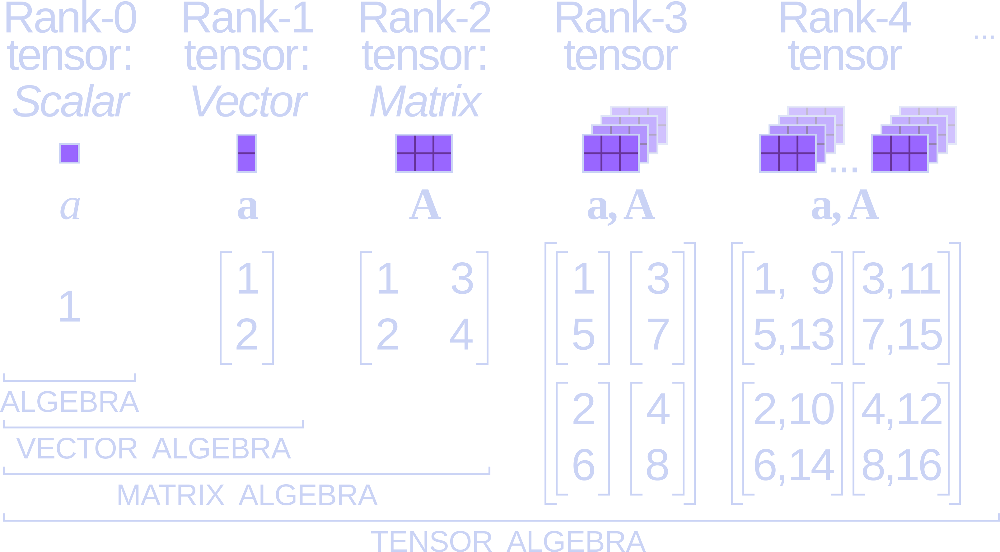
<!-- alignment: center -->
credit: Cmglee, GNU FDL

<!-- newlines: 1 -->
<!-- alignment: center -->
multi-dimensional array of arbitrary dimensions

---

What does a tensor look like in rust?
===

```typst +render +width:40%
#set table(
  stroke: none,
  inset: -1pt,
)

#let cell(angle: 170deg, dx: 0em, dy: 0em) = {
  stack(
    box(width: 100%, height: 100%),

    place(
      dx: dx,
      dy: dy,
      align(
        center,
        rotate(angle, line(length: 90%, stroke: (dash: "dashed", paint: rgb("#5b6078")))),
      ),
    )
  )
}

#table(
  columns: 4,
  [], [], [#cell()], [$mat(delim: "[", 41, 42; 43, 44)$],
  [], [#cell()], [$mat(delim: "[", 31, 32; 33, 34)$], [#cell(dy: 1em, angle: 170deg)],
  [#cell()], [$mat(delim: "[", 21, 22; 23, 24)$], [#cell(angle: 170deg, dy: 1em)], [],
  [$mat(delim: "[", 11, 12; 13, 14)$], [#cell(dy: 1em)], [], [],
)
```
<!-- newlines: 1 -->
<!-- pause -->

<!-- column_layout: [1, 1] -->

<!-- column: 0 -->
```rust +no_background
struct Tensor {
    data: Vec<f64>,
    shape: Shape,
    strides: Strides,
}
```
<!-- pause -->

<!-- column: 1 -->
```rust +no_background
let data = vec![
    11., 12., 13., 14.,
    21., 22., 23., 24.,
    31., 32., 33., 34.,
    41., 42., 43., 44.
];
```
<!-- pause -->

<!-- column: 0 -->
<!-- newlines: 1 -->
```rust +no_background
struct Shape { data: Vec<usize> }
```
<!-- pause -->

<!-- column: 1 -->
```rust +no_background
let shape = Shape::new(vec![4, 2, 2]);
```
<!-- pause -->

<!-- column: 0 -->
```rust +no_background
struct Strides { data: Vec<usize> }
```
<!-- pause -->

<!-- column: 1 -->
```rust +no_background
let strides = Strides::new(vec![4, 2, 1]);
```
<!-- pause -->

<!-- reset_layout -->
<!-- newlines: 2 -->
<!-- alignment: center -->
- transposition (permutation)
- adding / removing dimensions (viewing)

_=> don't require touching data_


---

Summary
===

<!-- newlines: 5 -->
# What's a tensor?
# What can we do with a tensor?

---

What can be done with a tensor?
===

<!-- newlines: 3 -->
<!-- column_layout: [3, 2] -->

<!-- column: 0 -->
```rust +no_background
pub trait Ops<E: Element> {

    fn map<F: Fn(E) -> E>(&self, f: F) -> Self;
```
<!-- pause -->

<!-- column: 1 -->
<!-- newlines: 1 -->
```typst +render +width:80%
$\{\ln(x), e^x, -x, frac(1, x), ...\}$
```
<!-- pause -->

<!-- column: 0 -->
```rust +no_background

    fn zip<F: Fn(E, E) -> E>(
        &self, other: &Self, f: F
    ) -> Option<Self>;
```
<!-- pause -->

<!-- column: 1 -->
```typst +render +width:80%
$\{x + y, x dot y, x = y, ...\}$
```
<!-- pause -->

<!-- column: 0 -->
```rust +no_background

    fn reduce<F: Fn(E, E) -> E>(
        &self,
        f: F,
        dim: usize,
        zero: E,
    ) -> Option<Self>;
```
<!-- pause -->

<!-- column: 1 -->
<!-- newlines: 2 -->
```typst +render +width:80%
$\{sum(x), product(x)\}$
```
<!-- pause -->

<!-- column: 0 -->
```rust +no_background

    fn matmul(
        &self, other: &Self
    ) -> Option<Self>;

}
```
---

Map
===

<!-- newlines: 6 -->
```rust +no_background {all|4-5|6-8|9-13|all}
fn map<F: Fn(f64) -> f64>(
    &self, f: F
) -> Self {
    let len = self.size();
    let mut out = vec![0.; len];
    for (i, d) in self.data.iter().enumerate() {
        out[i] = f(*d);
    }
    Self {
        data: out,
        shape: self.shape.clone(),
        strides: self.strides.clone(),
    }
}
```
---

Map - parallel using rayon
===

<!-- newlines: 4 -->
<!-- column_layout: [1, 1] -->

<!-- column: 0 -->
```rust +no_background {all|1|5|7|4-7|9|all}
fn map<F: Fn(f64) -> f64 + Sync>(
    &self, f: F
) -> Self {
    let out: Vec<_> = self.data
        .par_iter()
        .map(|d| f(*d))
        .collect();
    Self {
        data: Arc::new(out),
        shape: self.shape.clone(),
        strides: self.strides.clone(),
    }
}
```
<!-- pause -->

<!-- column: 1 -->
`Sync` => safe to share references between threads
<!-- pause -->
<!-- newlines: 5 -->
`Arc`  => thread-safe reference-counting pointer
<!-- pause -->

<!-- reset_layout -->
<!-- newlines: 1 -->
```rust +no_background
struct Tensor {
    data: Arc<Vec<f64>>,
    shape: Shape,
    strides: Strides,
}
```
---

Map - gpu using wgpu and wgsl
===

<!-- newlines: 4 -->
```rust +no_background {all|1-4|6-8|10|11|12|13|14|all}
@group(0) @binding(0)
var<storage, read> input: array<f32>;
@group(0) @binding(1)
var<storage, read_write> output: array<f32>;

fn neg(in: f32) -> f32 {
    return -in;
} // etc.

@compute
@workgroup_size(x, y, z)
fn call(@builtin(global_invocation_id) id: vec3<u32>) {
    let i = id.x;
    output[i] = replace_me(input[i]);
}
```

---

Map - orchestrating gpu code
===

<!-- newlines: 3 -->
```rust +no_background {all|1|2|4-5|7-10|4,12|14|16|all}
fn map(&self, f: &'static str) -> Self {
    let output_buffer = create_output_buffer(self.shape.gpu_byte_size());
    
    let workgroups = (&self.shape).into();
    let pipeline = get_or_create_pipeline(f, workgroups.size);

    let bind_group = create_bind_group(
        &[&self.buffer, &output_buffer],
        &pipeline.get_bind_group_layout(0),
    );

    let command = encode_command(&workgroups.count, &pipeline, &bind_group);

    submit_command(command);

    self.with_buffer(output_buffer)
}
```

<!-- pause -->
<!-- newlines: 1 -->
```rust +no_background
struct Tensor<'a> {
    buffer: Arc<Buffer>,
    shape: Shape,
    strides: Strides,
    context: &'a WgpuContext,
}
```
---

Map - gpu parallelism
===

<!-- alignment: center -->
workgroups are collections of threads that execute together and share local memory
<!-- pause -->

<!-- column_layout: [1, 1] -->

<!-- column: 0 -->
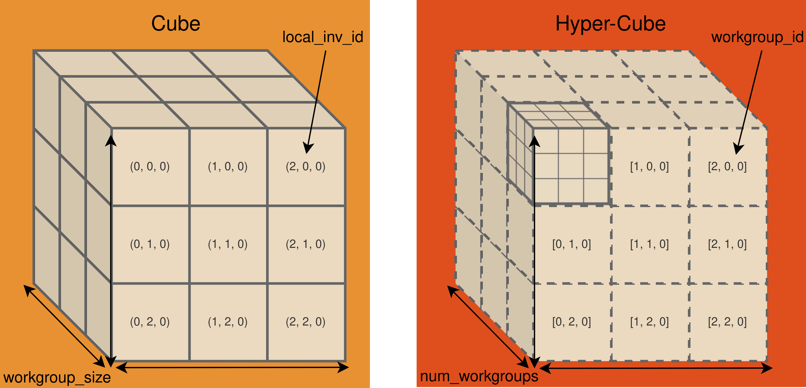
<!-- alignment: center -->
credit: CubeCL, Apache 2.0
<!-- pause -->

<!-- column: 1 -->
identifiers
```typst +render +width:100%
$vec("global_inv_id.x", "global_inv_id.y", "global_inv_id.z") = vec("local_inv_id.x" times "workgroup_id.x", "local_inv_id.y" times "workgroup_id.y", "local_inv_id.z" times "workgroup_id.z")$
```
<!-- pause -->
total invocations
```typst +render +width:80%
$vec("workgroup_size.x", "workgroup_size.y", "workgroup_size.z") dot vec("num_workgroups.x", "num_workgroups.y", "num_workgroups.z")$
```
<!-- pause -->

<!-- column: 0 -->
<!-- newlines: 1 -->
```rust +no_background {all|2|6-7|8|all}
@compute
@workgroup_size(wsx, wsy, wsz)
fn call(@builtin(global_invocation_id)
    id: vec3<u32>
) {
    // (id.x, id.y, id.z) unique thread id
    let i = id.x; 
    output[i] = input[i];
}
```
<!-- pause -->

<!-- column: 1 -->
<!-- newlines: 2 -->
```rust +no_background {all|6|all}
// encode_command explained
let mut encoder = create_command_encoder();
let mut pass = encoder.begin_compute_pass();
pass.set_pipeline(pipeline);
pass.set_bind_group(0, Some(bind_group));
pass.dispatch_workgroups(nwx, nwy, nwz);
encoder.finish()
```
---

Summary
===

<!-- newlines: 5 -->
# What's a tensor?
# What can we do with a tensor?
## Map
## Zip

---

Zip - broadcasting
===

<!-- alignment: center -->
...you'll remember there are rules for element-wise operations...
<!-- pause -->
<!-- newlines: 1 -->

<!-- column_layout: [1, 1] -->

<!-- column: 0 -->
<!-- alignment: center -->
<span style="color:#a6da95">do's 👍</span>
<!-- pause -->

```typst +render +width:45%
$
1
+
underbrace(
  mat(
    1, ..., 2;
    dots.v, dots.down, dots.v;
    3, ..., 4;
  ),
  n,
) lr(size: #3em, brace.r) m
=
underbrace(
  mat(
    2, ..., 3;
    dots.v, dots.down, dots.v;
    4, ..., 5;
  ),
  n,
) lr(size: #3em, brace.r) m
$
```
<!-- pause -->
```typst +render +width:55%
$
m lr(size: #3em, brace.l) vec(
  1, dots.v, 2
) 
+
underbrace(
  mat(
    1, ..., 2;
    dots.v, dots.down, dots.v;
    3, ..., 4;
  ),
  n,
) lr(size: #3em, brace.r) m
=
underbrace(
  mat(
   2, ..., 3;
   dots.v, dots.down, dots.v;
   5, ..., 6;
  ),
  n,
) lr(size: #3em, brace.r) m
$
```
<!-- pause -->
```typst +render +width:55%
$
underbrace(
  (1 ... 2),
  n
) 
+
underbrace(
  mat(
    1, ..., 2;
    dots.v, dots.down, dots.v;
    3, ..., 4;
  ),
  n,
) lr(size: #3em, brace.r) m
=
underbrace(
  mat(
   2, ..., 4;
   dots.v, dots.down, dots.v;
   4, ..., 6;
  ),
  n,
) lr(size: #3em, brace.r) m
$
```
<!-- pause -->
```typst +render +width:100%
$
m lr(size: #3em, brace.l) underbrace(
  mat(
    1, ..., 2;
    dots.v, dots.down, dots.v;
    3, ..., 4;
  ),
  n,
) 
+
underbrace(
  mat(
    1, ..., 2;
    dots.v, dots.down, dots.v;
    3, ..., 4;
  ),
  n,
) lr(size: #3em, brace.r) m
=
underbrace(
  mat(
   2, ..., 4;
   dots.v, dots.down, dots.v;
   6, ..., 8;
  ),
  n,
) lr(size: #3em, brace.r) m
$
```
<!-- pause -->

<!-- column: 1 -->
<!-- alignment: center -->
<span style="color:#ed8796">dont's 👎</span>

<!-- pause -->
```typst +render +width:70%
$
p != m, #h(0.5em)
p lr(size: #3em, brace.l) vec(
  a_1, dots.v, a_p
) 
+
underbrace(
  mat(
    b_11, ..., b(1n);
    dots.v, dots.down, dots.v;
    b_(m 1), ..., b_(m n);
  ),
  n,
) lr(size: #3em, brace.r) m
$
```
<!-- pause -->
```typst +render +width:70%
$
q != n, #h(0.5em)
underbrace(
  (a_1 ... a_q),
  q
) 
+
underbrace(
  mat(
    b_11, ..., b_(1n);
    dots.v, dots.down, dots.v;
    b_(m 1), ..., b_(m n);
  ),
  n,
) lr(size: #3em, brace.r) m
$
```
<!-- pause -->
```typst +render +width:90%
$
p != m, #h(0.5em) q != n, #h(0.5em)
p lr(size: #3em, brace.l) underbrace(
  mat(
    a_11, ..., a_(1q);
    dots.v, dots.down, dots.v;
    a_(p 1), ..., a_(p q);
  ),
  q,
) 
+
underbrace(
  mat(
    b_11, ..., b_(1n);
    dots.v, dots.down, dots.v;
    b_(m 1), ..., b_(m n);
  ),
  n,
) lr(size: #3em, brace.r) m
$
```

---

Zip - broadcasting cont'd
===

<!-- column_layout: [6, 3] -->

<!-- column: 0 -->
<!-- newlines: 3 -->
```rust +no_background {all|1|2-3|5|7|8-9|11-16|19|all}
fn broadcast(&self, b: &Shape) -> Option<Shape> {
    let (n, m) = (self.len(), b.len());
    let max = m.max(n);

    let mut out = Vec::with_capacity(max);

    for i in (0..max).rev() {
        let si = if i < n { self[n - 1 - i] } else { 1 };
        let bi = if i < m { b[m - 1 - i] } else { 1 };

        match (si, bi) {
            (1, b) => out.push(b),
            (s, 1) => out.push(s),
            (s, b) if s == b => out.push(s),
            _ => return None,
        }
    }

    Some(Shape::new(out))
}
```
<!-- pause -->

<!-- column: 1 -->
```typst +render +width:70%
$vec(1) #h(0.5em) "bc" #h(0.5em) vec(2, 3) = vec(2, 3)$
```
<!-- pause -->
```typst +render +width:70%
$vec(5) #h(0.5em) "bc" #h(0.5em) vec(2, 5) = vec(2, 5)$
```
<!-- pause -->
```typst +render +width:85%
$vec(2, 3, 1) #h(0.5em) "bc" #h(0.5em) vec(7, 2, 3, 5) = vec(7, 2, 3, 5)$
```
<!-- pause -->
```typst +render +width:55%
$vec(5) #h(0.5em) #strike(stroke: 1pt + red)[bc] #h(0.5em) vec(5, 2)$
```
<!-- pause -->
```typst +render +width:65%
$vec(5, 7, 5, 1) #h(0.5em) #strike(stroke: 1pt + red)[bc] #h(0.5em) vec(1, 5, 1, 5)$
```

---

Zip - impl
===

<!-- column_layout: [1, 1] -->

<!-- column: 0 -->
```rust +no_background +line_numbers
fn zip<F: Fn(f64, f64) -> f64>(
    &self,
    other: &Self,
    f: F
) -> Option<Self> {
    let shape = if self.shape == other.shape {
        self.shape.clone()
    } else {
        self.shape.broadcast(&other.shape)?
    };
    let strides: Strides = (&shape).into();

    let mut out = vec![0.; shape.size];

    for i in 0..shape.size {
        let idx = strides.idx(i);
        let idxa = idx.broadcast(&self.shape);
        let idxb = idx.broadcast(&other.shape);
        let posa = self.strides.position(&idxa);
        let posb = other.strides.position(&idxb);
        let va = self.data[posa];
        let vb = other.data[posb];
        let pos = strides.position(&idx);
        out[pos] = f(va, vb);
    }

    Some(Self::new(out, shape, strides))
}
```
<!-- pause -->

<!-- column: 1 -->
```typst +render +width:75%
$
    1 lr(size: #1em, brace.l) underbrace((1 #h(0.5em) 2), 2) +
    underbrace(vec(3, 4), 1) lr(size: #2em, brace.r) 2 =
    mat(4, 5; 5, 6)
$
```
<!-- pause -->
```rust +no_background
[2, 2]
```
<!-- pause -->
```rust +no_background
[2, 1]
```
<!-- pause -->
```rust +no_background
out = [0, 0, 0, 0]
```
<!-- pause -->
```rust +no_background
i = 3
idx = [1, 1]  // 1D => nD: 3 / 2 => (3 % 2) / 1
idxa = [0, 1] // [1, 1] bc [1, 2]
idxb = [1, 0] // [1, 1] bc [2, 1]
posa = 1      // nD => 1D: [1, 2] pos [0, 1]
posb = 1      // nD => 1D: [2, 1] pos [1, 0]
va = 2
vb = 4
pos = 3       // nD => 1D: [2, 1] pos [1, 1]
out[3] = 2 + 4 = 6
```

---

Summary
===

<!-- newlines: 5 -->
# What's a tensor?
# What can we do with a tensor?
## Map
## Zip
## Reduce

---

Reduce
===

<!-- newlines: 3 -->
<!-- column_layout: [1, 1] -->

<!-- column: 0 -->
```typst +render +width:80%
$
    sum_(d=0) mat(1, 2, 3; 4, 5, 6) = #h(0.5em) ?
$
```
<!-- pause -->
```typst +render +width:50%
$
    (5 #h(0.5em) 7 #h(0.5em) 9)
$
```
<!-- pause -->

<!-- column: 1 -->
```typst +render +width:80%
$
    sum_(d=1) mat(1, 2, 3; 4, 5, 6) = #h(0.5em) ?
$
```
<!-- pause -->
```typst +render +width:40%
$
    vec(6, 15)
$
```

---

Reduce - impl
===

<!-- column_layout: [1, 1] -->

<!-- column: 0 -->
```rust +no_background +line_numbers
fn reduce<F: Fn(f64, f64) -> f64>(
    &self,
    f: F,
    dim: usize,
    zero: f64,
) -> Self {
    let mut shape_data = self.shape.to_vec();
    shape_data[dim] = 1;
    let shape = Shape::new(shape_data);
    let strides: Strides = (&shape).into();

    let len = shape.size;
    let mut out = vec![zero; len];

    for i in 0..len {
        let mut idx = strides.idx(i);
        let out_pos = strides.position(&idx);
        for j in 0..self.shape[dim] {
            idx[dim] = j;
            let pos = self.strides.position(&idx);
            let v_self = self.data[pos];
            out[out_pos] = f(out[out_pos], v_self);
        }
    }
    Self::new(out, shape, strides)
}
```

<!-- pause -->

<!-- column: 1 -->
```typst +render +width:55%
$
    product_(d=1) mat(1, 2, 3; 4, 5, 6; 7, 8, 9) = vec(6, 120, 504)
$
```
<!-- pause -->
```rust +no_background
[3, 1]
[1, 1]
```
<!-- pause -->
<!-- newlines: 1 -->
```rust +no_background
out = [1, 1, 1]
```
<!-- pause -->
```rust +no_background
i = 2
idx = [2, 0]      // 1D => nD: 2 / 1 => (2 % 1) / 1
out_pos = 2       // [1, 1] pos [2, 0]
j = {0, 1, 2}
idx = {[2, 0], [2, 1], [2, 2]}
pos = {6, 7, 8}   // nD => 1D: [3, 1] pos idx
v_self = {7, 8, 9}
out[2] = {1 * 7, 7 * 8, 56 * 9}
```

---

Summary
===

<!-- newlines: 5 -->
# What's a tensor?
# What can we do with a tensor?
## Map
## Zip
## Reduce
## Matmul

---

Matmul
===

<!-- alignment: center -->
...you'll also remember there are rules for matrix multiplication...


```typst +render +width:55%
#let hlp(x) = text(fill: rgb("#f5a97f"))[$#x$]
#let hlm(x) = text(fill: rgb("#c6a0f6"))[$#x$]

#let hll(x) = {
  set text(fill: gradient.linear(rgb("#c6a0f6"), rgb("#f5a97f")))
  box($#x$)
}
#let hlr(x) = {
  set text(fill: gradient.linear(rgb("#f5a97f"), rgb("#c6a0f6")))
  box($#x$)
}

#grid(
  columns: 2,
  column-gutter: 0.5em,
  row-gutter: 0.3em,
  align: (right + bottom, left + bottom),
  [],
  $ n lr(size: #3em, brace.l) overbrace(mat(hlm(1), hlp(2); hlm(3), hlp(4); hlm(5), hlp(6)), p) $,
  $ m lr(size: #2em, brace.l) underbrace(mat(hlm(1), hlm(2), hlm(3); hlp(4), hlp(5), hlp(6)), n) $,
  $ m lr(size: #2em, brace.l) underbrace(mat(hlm(22), hll(28); hlr(49), hlp(64)), p) $,
)
```

---

Matmul - impl
===

<!-- column_layout: [1, 1] -->

<!-- column: 0 -->
<!-- newlines: 5 -->
```rust +no_background +line_numbers
fn matmul(&self, rhs: &Self) -> Option<Self> {
    let lhs_rank = self.shape.len();
    let rhs_rank = rhs.shape.len();
    
    let n1 = self.shape[lhs_rank - 1];
    let n2 = rhs.shape[rhs_rank - 2];
    (n1 == n2).then_some(())?;

    let m = self.shape[lhs_rank - 2];
    let p = rhs.shape[rhs_rank - 1];

    let lhs_shape = self.shape.drop_right(2);
    let rhs_shape = rhs.shape.drop_right(2);

    let mut shape =
        lhs_shape.broadcast(&rhs_shape)?;
    shape.push(m);
    shape.push(p);
    let len = shape.size;
    let strides: Strides = (&shape).into();

    let mut out = vec![0.; len];

    // to be continued ...
```

<!-- pause -->

<!-- column: 1 -->
```typst +render +width:90%
$
m lr(size: #2em, brace.l) underbrace(mat(1, 2, 3; 4, 5, 6), n)  times
underbrace(mat(1, 2; 3, 4; 5, 6), p) lr(size: #3em, brace.r) n =
underbrace(mat(22, 28; 49, 64), p) lr(size: #2em, brace.r) m
$
```

<!-- pause -->

```rust +no_background
n1 = 3 // nb cols A
n2 = 3 // nb rows B
```
<!-- pause -->
<!-- newlines: 1 -->
```rust +no_background
m = 2 // nb rows A
p = 2 // nb cols B
```
<!-- pause -->
<!-- newlines: 4 -->
```rust +no_background
[]
[2]
[2, 2]

[2, 1]
```
<!-- pause -->
```rust +no_background
[0, 0, 0, 0]
```

---

Matmul - impl cont'd
===

<!-- column_layout: [1, 1] -->

<!-- column: 0 -->
<!-- newlines: 5 -->
```rust +no_background +line_numbers
    // ... continuing

    for (i, out_i) in out.iter_mut().enumerate() {

        let idx = strides.idx(i);
        let mut lhs_idx = idx.broadcast(&self.shape);
        let mut rhs_idx = idx.broadcast(&rhs.shape);

        let mut tmp = 0.;
        for pos in 0..n {
            lhs_idx[lhs_rank - 1] = pos;
            rhs_idx[rhs_rank - 2] = pos;
            let lhs_pos =
                self.strides.position(&lhs_idx);
            let rhs_pos =
                rhs.strides.position(&rhs_idx);
            tmp +=
                self.data[lhs_pos] * rhs.data[rhs_pos];
        }
        *out_i = tmp;
    }

    Some(Self::new(out, shape, strides))
}
```

<!-- pause -->

<!-- column: 1 -->
```typst +render +width:70%
$
m lr(size: #2em, brace.l) underbrace(mat(1, 2, 3; 4, 5, 6), n)  times
underbrace(mat(1, 2; 3, 4; 5, 6), p) lr(size: #3em, brace.r) n =
underbrace(mat(22, 28; 49, 64), p) lr(size: #2em, brace.r) m
$
```

<!-- pause -->

```rust +no_background
i = 3
```
<!-- pause -->
```rust +no_background
idx = [1, 1] // [2, 1] idx 3, 3 / 2 => (3 % 2) / 1
lhs_idx = [1, 1] // [1, 1] bc [2, 3]
rhs_idx = [1, 1] // [1, 1] bc [3, 2]
```
<!-- pause -->
```rust +no_background

pos = {0, 1, 2}
lhs_idx = {[1, 0], [1, 1], [1, 2]}
rhs_idx = {[0, 1], [1, 1], [2, 1]}

lhs_pos = {3, 4, 5} // nD => 1D: [3, 1] pos lhs_idx
rhs_pos = {1, 3, 5} // nD => 1D: [2, 1] pos rhs_idx

tmp = {4 * 2, 8 + 5 * 4, 28 + 6 * 6} => 64
```

---

Part 2
===

---

What are tensors useful for?
===

<!-- newlines: 3 -->
<!-- pause -->
Neural networks!

<!-- pause -->
- function approximators parameterized by ... tensors

<!-- pause -->
- input / output ...

<!-- pause -->
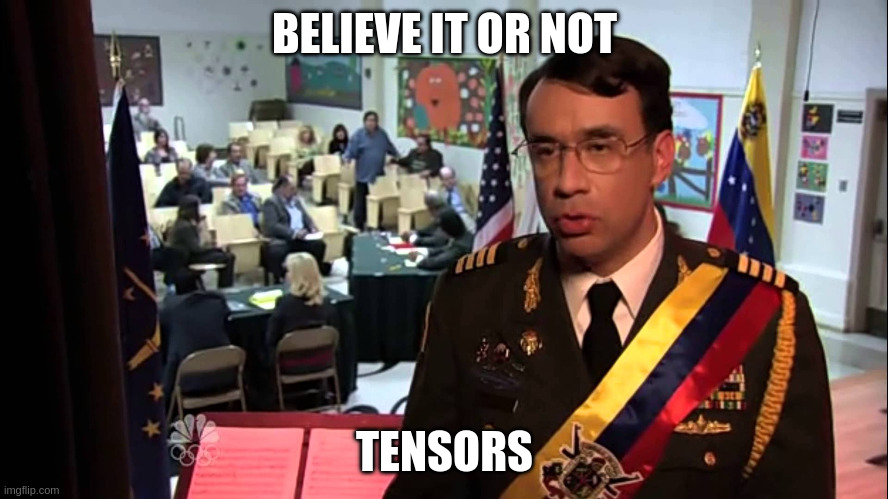

---

What's a neural network anyway?
===

```typst +render +width:40%
$
forall f in C(RR^n), #h(0.5em) forall epsilon.alt > 0, #h(0.5em)  forall x in RR^n,
$
```
```typst +render +width:30%
$
exists accent(f, hat), #h(0.5em) abs(f(x) - accent(f, hat)(x)) < epsilon.alt
$
```
<!-- pause -->
```typst +render +width:35%
$
accent(f, hat)(x) = sum_(i=1)^M c_i dot sigma (w_i^T x + b_i)
$
```

<!-- alignment: center -->
universal approximation theorem 🔥

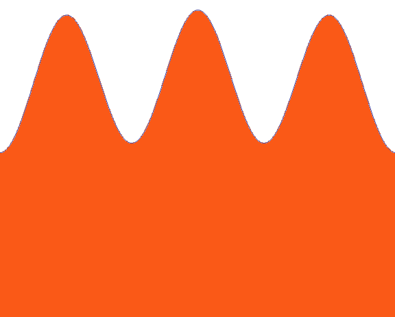
credit: Doleron, CC BY-SA 3.0

---

But like, really, what's a neural network?
===

```typst +render +width:30%
$
accent(f, hat)(x) = sum_(i=1)^M c_i dot sigma (w_i^T x + b_i)
$
```

<!-- column_layout: [1, 1] -->

<!-- column: 0 -->
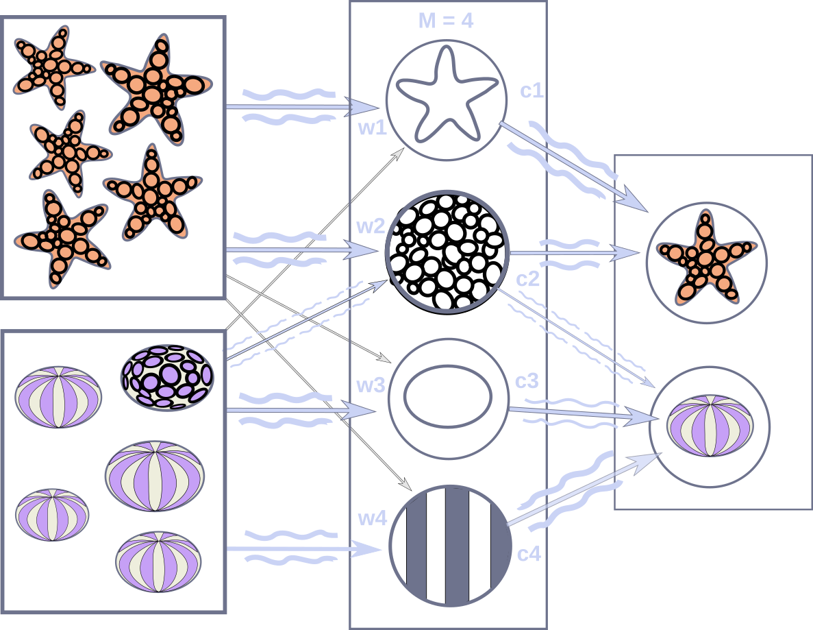
<!-- alignment: center -->
credit: Mikael Häggström, CC0

<!-- column: 1 -->
```typst +render +width:40%
$
sigma(x) = (1 + e^x)^(-1)
$
```
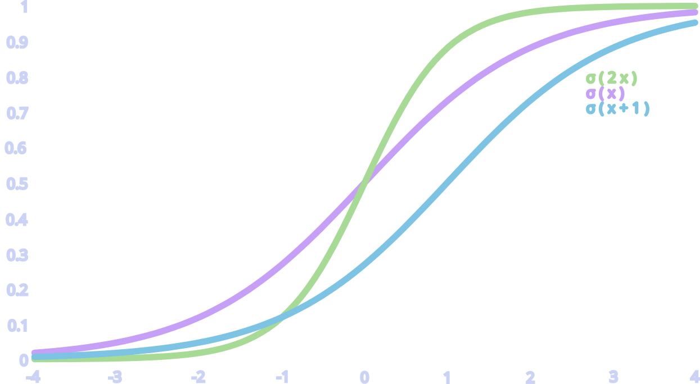

---

To recap
===

```typst +render +width:30%
$
accent(f, hat)(x) = sum_(i=1)^M c_i dot sigma (w_i^T x + b_i)
$
```

<!-- incremental_lists: true -->
We need:

- neurons
- weights: connections between neurons
  - `wi` input -> hidden: the feature extracted by the neuron from the input
  - `ci` hidden -> output: how important is this feature
- `bi` biases: how much of the feature is needed for the neuron to activate
- layers: input, hidden, output
- `σ` activation function: yes/no detectors, making `wx + b` non-linear
- a way to convert the result:

<!-- column_layout: [1, 1] -->

<!-- column: 0 -->
```typst +render +width:100%
$
accent(p, hat)(y = "starfish" | x) = sigma(accent(f, hat)(x)) \
accent(p, hat)(y = "urchin" | x) = 1 - accent(p, hat)(y = "starfish" | x) 
$
```

<!-- column: 1 -->
<!-- pause -->


---

In Rust please!? - layer
===

<!-- column_layout: [1, 2] -->

<!-- column: 0 -->
<!-- newlines: 3 -->
<!-- pause -->
```rust +no_background
struct Layer<'a, B: Backend> {
    name: &'a str,
    weights: Tensor<'a, B>,
    biases: Tensor<'a, B>,
}
```

<!-- pause -->
<!-- column: 1 -->
<!-- newlines: 3 -->
```rust +no_background {all|2-6|9-10|11-12|16|17-19|all}
impl<'a, B: Backend> Layer<'a, B> {
    pub fn new(
        name: &'a str,
        in_size: usize,
        out_size: usize,
    ) -> Self {
        Self {
            name,
            // shape [in_size, out_size]
            weights: Self::weights(name, in_size, out_size),
            // shape [out_size]
            biases: Self::biases(name, out_size),
        }
    }

    fn forward(&self, x: Tensor<'a, B>) -> Tensor<'a, B> {
        // weights is shape [in_size, out_size]
        // result is shape [n_inputs, out_size]
        x.matmul(self.weights) + self.biases
    }
}
```

---

In Rust please!? - network
===

```rust +no_background
struct Network<'a, B: Backend> {
    input_layer: Layer<'a, B>,
    hidden_layer: Layer<'a, B>,
    output_layer: Layer<'a, B>,
}
```
<!-- pause -->
```rust +no_background {all|2-7|9-13|10|11|12|all}
impl<'a, B: Backend> Network<'a, B> {
    fn new(n_features: usize, hidden_layer_size: usize) -> Self {
        let input_layer = Layer::new("input", n_features, hidden_layer_size);
        let hidden_layer = Layer::new("hidden", hidden_layer_size, hidden_layer_size);
        let output_layer = Layer::new("output", hidden_layer_size, 1);
        Self { input_layer, hidden_layer, output_layer }
    }

    fn forward(&self, x: Tensor<'a, B>) -> Tensor<'a, B> {
        let i = self.input_layer.forward(x).sigmoid();
        let h = self.hidden_layer.forward(i).sigmoid();
        self.output_layer.forward(h).sigmoid()
    }
```
<!-- pause -->
<!-- column_layout: [4, 1] -->
<!-- column: 0 -->
```rust +no_background
          fn forward_uat(&self, x: Tensor<'a, B>) -> Tensor<'a, B> {
              let h = self.hidden_layer.forward(x).sigmoid();
              self.output_layer.forward(h)
          }
      }
```

---

Summary
===

# Part 1
## What's a tensor?
## What can we do with a tensor?
# Part 2
## What's a neural network?
## Training

---

Training
===

<!-- newlines: 2 -->
<!-- column_layout: [1, 1] -->
<!-- column: 0 -->
how do we get to this ...
<!-- newlines: 1 -->

<!-- pause -->
<!-- column: 1 -->
... from this
<!-- newlines: 1 -->
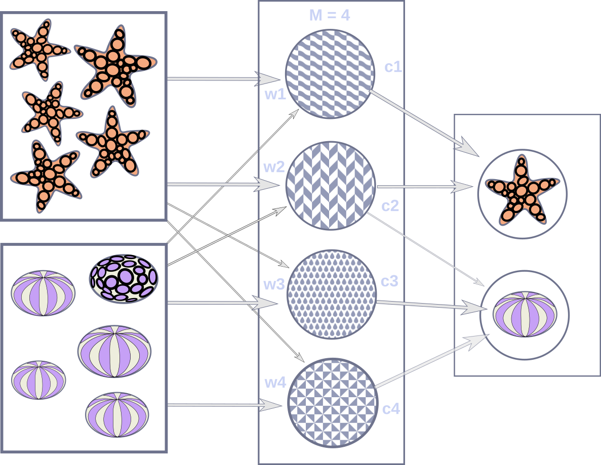

---

How does the network learn?
===

<!-- pause -->
<!-- column_layout: [1, 1] -->

<!-- column: 0 -->

<!-- list_item_newlines: 3 -->
- gather a lot of inputs

<!-- column: 1 -->
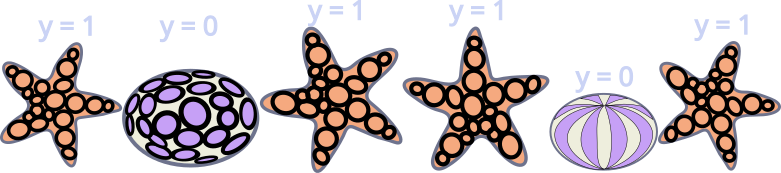

<!-- column: 0 -->
<!-- pause -->
- forward pass: feed input through the network

<!-- column: 1 -->
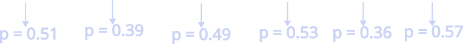

<!-- column: 0 -->
<!-- pause -->
<!-- list_item_newlines: 2 -->
- backward pass:
  - compute network performance <=> loss

<!-- column: 1 -->
<!-- pause -->
<!-- newlines: 1 -->
```typst +render +width:50%
$"loss" = frac(1, N) sum_(i = 1)^N abs(y_i - p_i)$
```

<!-- column: 0 -->
<!-- pause -->
  - determine the loss' gradients (derivatives)
<!-- pause -->
  - propagate gradients by updating weights and biases
<!-- pause -->
- rinse and repeat for `n` iterations

<!-- column: 1 -->
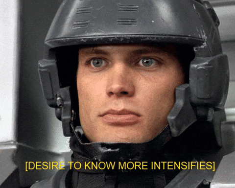

---

Summary
===

# Part 1
## What's a tensor?
## What can we do with a tensor?
# Part 2
## What's a neural network?
## Training
### Loss function

---

Loss function
===

<!-- column_layout: [1, 1] -->

<!-- column: 0 -->

Well, we're not gonna use
```typst +render +width:60%
$"L1" = frac(1, N) sum_(i = 1)^N abs(y_i - p_i)$
```

<!-- pause -->

but rather
```typst +render +width:100%
$"BCE" = -frac(1, N) sum_(i = 1)^N (y_i log(p_i) + (1 - y_i) log(1 - p_i))$
```

why ?

<!-- pause -->

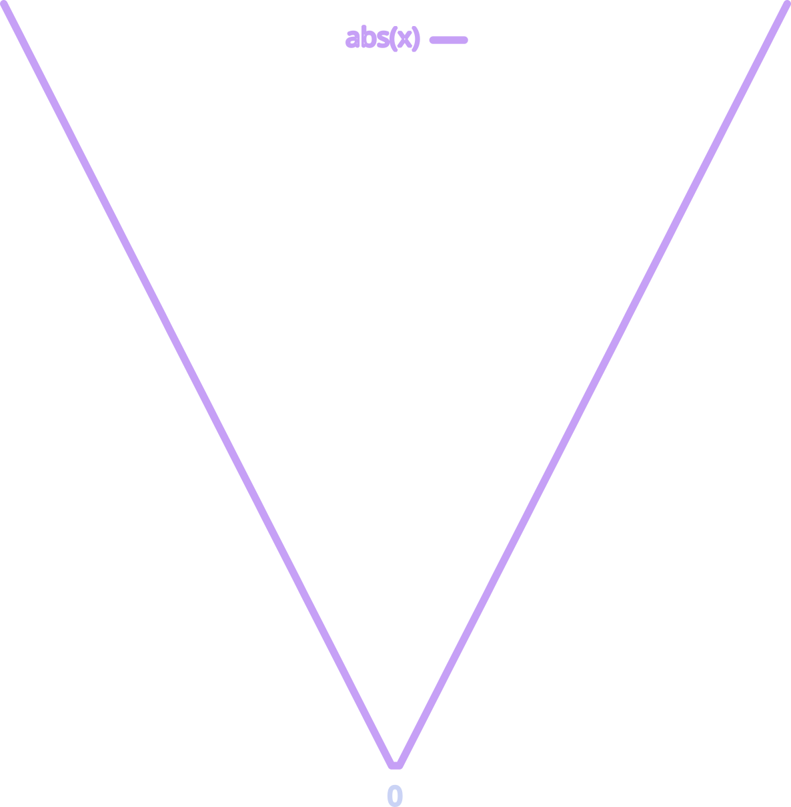

&nbsp; and we want to compute its derivatives / gradients

<!-- pause -->

<!-- column: 1 -->

<!-- newlines: 2 -->

and also

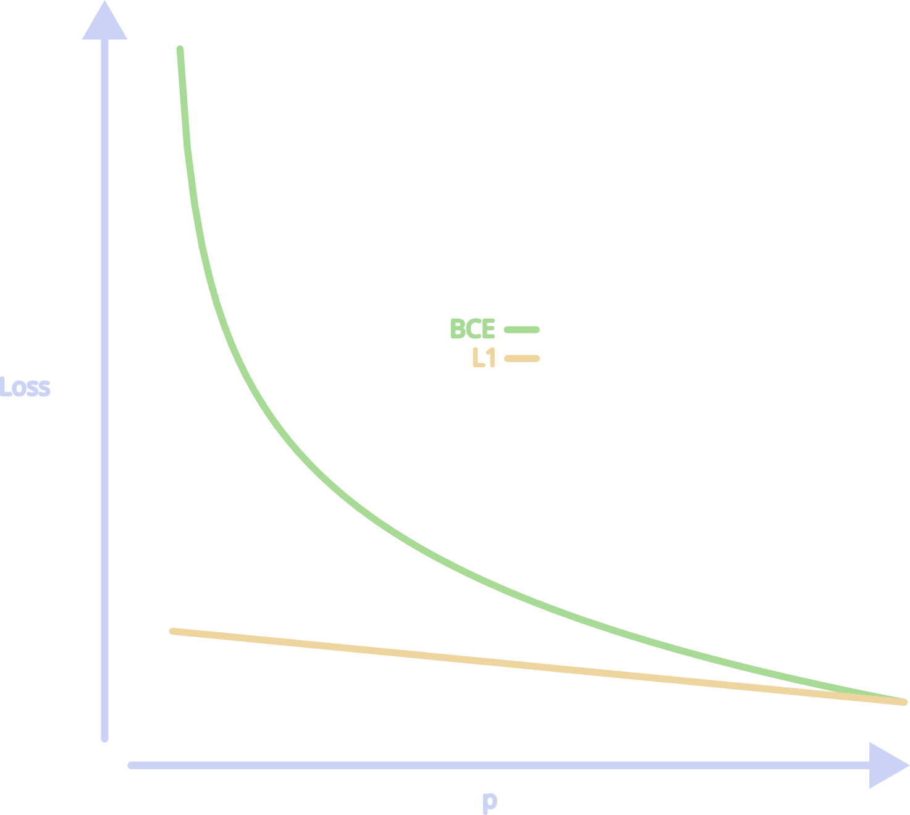

---

Summary
===

# Part 1
## What's a tensor?
## What can we do with a tensor?
# Part 2
## What's a neural network?
## Training
### Loss function
### Gradient computations

---

How to get the loss' gradients? - numerical differentiation
===

<!-- column_layout: [5, 2] -->

<!-- column: 0 -->
if you remember your calculus classes ...
```typst +render +width:70%
derivative definition: #h(0.5em) $f: RR -> RR, #h(0.5em) frac(diff f, diff x) = lim_(h -> 0) frac(f(x + h) - f(x), h)$
```

<!-- column: 1 -->
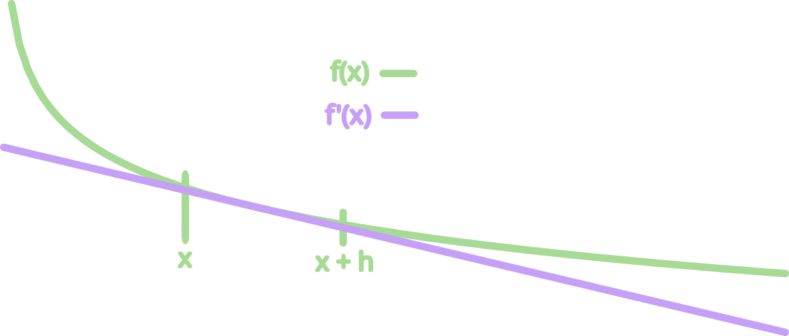
<!-- column: 0 -->

<!-- pause -->

```typst +render +width:75%
using Taylor's theorem: #h(0.5em) $f: RR -> RR, #h(0.5em) frac(diff f, diff x) approx frac(f(x + h) - f(x), h) + O(h)$
```
<!-- incremental_lists: true -->
- `O` is the truncation error
- we're mis-approximating the derivative with some error dependent on `h`
- as `h` goes down, the truncation error goes down 👌
- but ... as `h` is nearing `0`, we introduce a round-off error: underflow to `0`
<!-- column: 1 -->
<!-- newlines: 2 -->
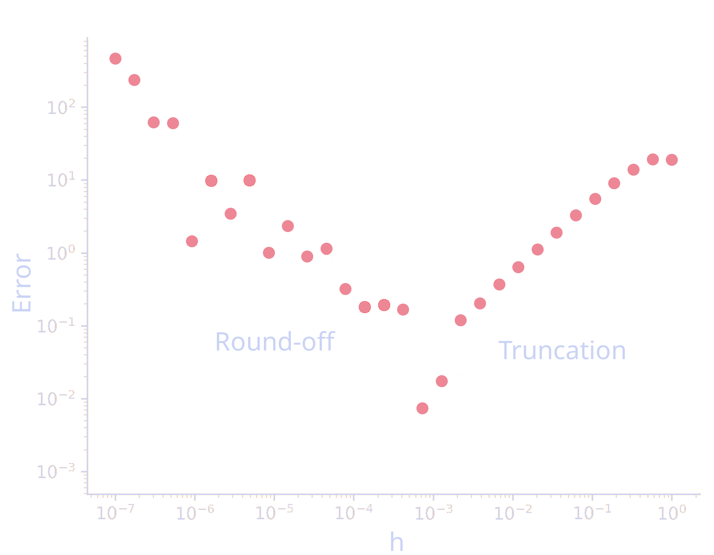
<!-- column: 0 -->
- round-off error worsens as floating point precision decreases
- cost increases as floating point precision increases
- max for my gpu is `f32`, SOTA is using `f4`

there is another problem however...
<!-- pause -->

```typst +render +width:70%
for tensors: #h(0.5em) $f: RR^n -> RR^m, #h(0.5em) frac(diff f_j, diff x_i) = frac(f_j (x_i + h) - f_j (x_i), h) + O(h) $
```

- this is `O(mn)` complexity
- we could have **millions or more** of parameters
- _=> won't work_
- _still very useful for property tests_

---

How to get the loss' gradients? - symbolic differentiation
===

if you remember your calculus classes ...
```typst +render +width:30%
$
f(x) = x^2, #h(1em) f'(x) = 2x
$
```
<!-- incremental_lists: true -->
- no numerical inaccuracies
- no numerical instabilities
- expression which can compute a gradient directly 🥳

there are other issues however...
<!-- pause -->
```typst +render +width:40%
$frac(d, d x) f(x) g(x) = f'(x) g(x) + g'(x) f(x)$
```

<!-- column_layout: [5, 2] -->

<!-- column: 0 -->
<!-- incremental_lists: true -->
- this is `O(2^n)` complexity
- we could have **hundreds** of these functions nested within each other
- quickly becomes untractable
- is also limited to closed form expressions: `+`, `-`, `x`, `/`, `^`, `√`, `e`, `log`, trig fns
- can't have `>`, `==`, `is close to` as they are not symbolically differentiable
- _=> won't work_

<!-- column: 1 -->


---

How to get the loss' gradients? - automatic differentiation
===

- aka `AD`, aka reverse mode `AD` (yes, there is a forward mode)

<!-- pause -->
```typst +render +width:60%
$
y = c dot sigma (w^T x + b) #h(4em)
x = 2, #h(0.5em) w = 0.1, #h(0.5em) b = -0.1, #h(0.5em) c = 3
$
```

<!-- pause -->
- relies on: <span style="color: #f5a97f">an evaluation trace</span> + _a computational DAG_ 

<!-- pause -->
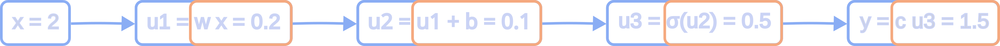

<!-- pause -->
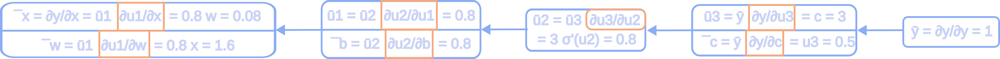

<!-- incremental_lists: true -->
- adjoints `ū = ȳ ∂y/∂u` represents the sensitivity of the output `y` wrt `u`
- leverages the *chain rule* over and over:

```typst +render +width:80%
$
g(f(x)), #h(1.5em) frac(d g, d x) = frac(d g, d f) dot frac(d f, d x) #h(5em)
y(u_3(u_2(u_1(x)))), #h(1.5em) macron(u)_2 = macron(u)_3 dot frac(∂ u_3, ∂ u_2) = frac(∂ y, ∂ u_3) dot frac(∂ u_3, ∂ u_2)
$
```

<!-- column_layout: [2, 1] -->

<!-- column: 0 -->
<!-- incremental_lists: true -->
- forward pass `O(n)`
- backward pass `O(n)` once the DAG is topologically sorted
- great for large inputs, small outputs: all `dL/dxi` in one pass
- _=> will work_

<!-- column: 1 -->


<!-- pause -->
<!-- reset_layout -->
<!-- alignment: center -->
blog post by Andrew M Holmes: [](huggingface.co/blog/andmholm/what-is-automatic-differentiation)

---

Summary
===

# Part 1
## What's a tensor?
## What can we do with a tensor?
# Part 2
## What's a neural network?
## Training
### Loss function
### Gradient computation
### Gradient propagation

---

How to propagate the loss' gradients?
===

<!-- column_layout: [1, 1, 1] -->

<!-- column: 0 -->
Recap with `y => L` at iteration `i`:

```typst +render +width:80%
$
w_i = 0.1, #h(0.5em) macron(w_i) = frac(∂ L, ∂ w_i) = 1.6 \
b_i = -0.1, #h(0.5em) macron(b_i) = frac(∂ L, ∂ b_i) = 0.8 \
c_i = 3, #h(0.5em) macron(c_i) = frac(∂ L, ∂ c_i) = 0.5
$
```
<!-- pause -->
Gradient direction:
```typst +render +width:80%
$
frac(∂ L, ∂ p) > 0, #h(0.5em) p arrow.tr #h(0.5em) => #h(0.5em) L arrow.tr
$
```
<!-- pause -->
```typst +render +width:80%
$
frac(∂ L, ∂ p) < 0, #h(0.5em) p arrow.br #h(0.5em) => #h(0.5em) L arrow.br
$
```

<!-- pause -->
we introduce a `-1` factor as a result

<!-- column: 1 -->
<!-- pause -->
Learning rate `η`:
<!-- incremental_lists: true -->
- the step size at each iteration towards the min loss
- to what extent new info overrides old info
- speed at which the network learns

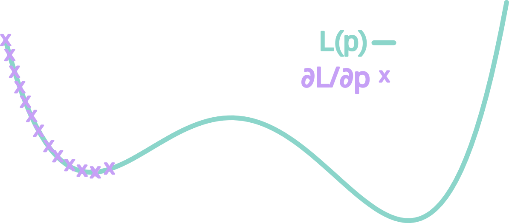
<!-- pause -->
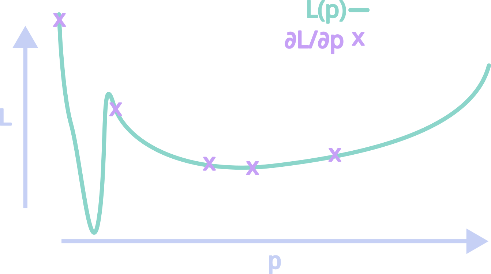

<!-- column: 2 -->
<!-- pause -->
Delta `Δ`:
```typst +render +width:80%
$
Delta p_i = -1 dot eta dot frac(∂ L, ∂ p_i) \
p_(i + 1) = p_(i) + Delta p_i
$
```

<!-- pause -->
<!-- newlines: 2 -->
For the next iteration:

```typst +render +width:100%
$
eta = 0.01 \
w_(i + 1) = w_i - 0.01 dot frac(∂ L, ∂ w) = .084 \
b_(i + 1) = b_i - 0.01 dot frac(∂ L, ∂ b) = -.108 \
c_(i + 1) = c_i - 0.01 dot frac(∂ L, ∂ c) = 2.995 \
$
```

<!-- reset_layout -->
<!-- alignment: center -->
<!-- pause -->
that's _gradient descent_

---

Summary
===

# Part 1
## What's a tensor?
## What can we do with a tensor?
# Part 2
## What's a neural network?
## Training
### Loss function
### Gradient computations
### Gradient propagation
### Rust implementation

---

Rust impl - evaluation trace
===

<!-- column_layout: [2, 4] -->

<!-- column: 0 -->
<!-- newlines: 1 -->
```rust +no_background
// Rc b/c we need Clone
// dyn b/c type erasure
enum Function<'a, B: Backend> {
    U(Rc<dyn Unary<'a, B>>),
    B(Rc<dyn Binary<'a, B>>),
}
```

<!-- column: 1 -->
<!-- pause -->
```rust +no_background
pub struct Ln;
impl<'a, B: Backend> Unary<'a, B> for Ln {
    fn fwd(&self, a: &B::Ops<'a>) -> B::Ops<'a> {
        a.map(|e| e.ln()) // < 0 amended
    }

    fn bwd(&self, i: &B::Ops<'a>, d: &B::Ops<'a>) -> B::Ops<'a> {
        i.zip(d, |ei, ed| ed / ei) // ei != 0 amended
    }
}
```
<!-- pause -->
```rust +no_background
pub struct Mul;
impl<'a, B: Backend> Binary<'a, B> for Mul {
    fn fwd(&self, a: &B::Ops<'a>, b: &B::Ops<'a>) -> B::Ops<'a> {
        a.zip(b, |e1, e2| e1 * e2)
    }

    fn bwd(
        &self,
        lhs: &B::Ops<'a>,
        rhs: &B::Ops<'a>,
        d: &B::Ops<'a>,
    ) -> (B::Ops<'a>, B::Ops<'a>) {
        (
            rhs.zip(d, |e1, e2| e1 * e2),
            lhs.zip(d, |e1, e2| e1 * e2),
        )
    }
}
```

<!-- column: 0 -->
<!-- newlines: 2 -->
<!-- pause -->
```rust +no_background
struct Trace<'a, B: Backend> {
    last_fn: Option<Function<'a, B>>,
    inputs: Vec<Tensor<'a, B>>,
}
```
<!-- newlines: 2 -->
<!-- pause -->
```rust +no_background
struct Tensor<'a, B: Backend> {
    ops: B::Ops<'a>,
    // Box b/c recursive struct
    // puts grad on the heap
    grad: Option<Box<Tensor<'a, B>>>,
    trace: Trace<'a, B>,
}
```

<!-- pause -->
_#rust_bookclub_

---

Rust impl - trace capture
===

<!-- column_layout: [2, 3] -->

<!-- column: 0 -->
```rust +no_background
pub struct Forward;
impl Forward {
    pub fn unary<'a, B: Backend>(
        u: impl Unary<'a, B>,
        a: Tensor<'a, B>,
    ) -> Tensor<'a, B> {
        let res = u.forward(&a);
        let trace = Trace::default()
            .last_fn(Function::U(Rc::new(u)))
            .push_input(a);
        Tensor::new(res, new_trace)
    }

    pub fn binary<'a, B: Backend>(
        b: impl Binary<'a, B>,
        lhs: Tensor<'a, B>,
        rhs: Tensor<'a, B>,
    ) -> Tensor<'a, B> {
        let res = b.forward(&lhs, &rhs);
        let trace = Trace::default()
            .last_fn(Function::B(Rc::new(b)))
            .push_input(lhs)
            .push_input(rhs);
        Tensor::new(res, trace)
    }
}
```

<!-- column: 1 -->
<!-- pause -->

<!-- newlines: 3 -->
```rust +no_background
impl<'a, B: Backend> Tensor<'a, B> {
    fn ln(self) -> Self {
        Forward::unary(Ln {}, self)
    }
}

t.ln()
```
<!-- pause -->
<!-- newlines: 3 -->
```rust +no_background
impl<'a, B: Backend> Mul<Tensor<'a, B>> for Tensor<'a, B> {
    type Output = Tensor<'a, B>;

    fn mul(self, rhs: Tensor<'a, B>) -> Self::Output {
        Forward::binary(binary::Mul {}, self, rhs)
    }
}

t1 * t2
```
<!-- reset_layout -->
<!-- pause -->
<!-- alignment: center -->
that's _forward_ done!

---

Rust impl - chain rule
===

```rust +no_background
// Self is Tensor<'a, B>
fn chain_rule(&self, d: &Self) -> impl Iterator<Item = (&Self, Self)> {
    let inputs = &self.trace.inputs;
    let gradients = self
        .trace
        .last_fn
        .map(|f| match f {
            Function::B(b) => {
                let (da, db) = b.backward(&inputs[0], &inputs[1], d);
                vec![da, db]
            }
            Function::U(u) => {
                let da = u.backward(&inputs[0], d);
                vec![da]
            }
        })
        .unwrap_or_default();
    inputs.iter().zip(gradients)
}
```

<!-- pause -->
```typst +render +width:100%
$
d = frac(partial L, partial y) \
"unary" y = f(x) => [(x, d dot f'(x))] \
"binary" y = f(a, b) => [(a, d dot (partial f) / (partial a)), (b, d dot (partial f) / (partial b))] 
$
```

---

Rust impl - backprop
===

<!-- newlines: 1 -->
```rust +no_background
fn backprop(&self, d: Self) -> Gradients<'a, B> {
    let mut intermediates = HashMap::from([(self.id, d)]);
    let mut leaves = HashMap::new();

    for node in self.topological_sort() {
        let d = intermediates[&node.id];
        for (parent, d_i) in node.chain_rule(&d_i) {
            if parent.is_leaf() {
                *leaves.entry(parent.id).or_default() += d_i;
            } else {
                *intermediates.entry(parent.id).or_default() += d_i;
            }
        }
    }
    Gradients(leaves)
}
```

<!-- newlines: 3 -->
<!-- incremental_lists: true -->
- topological sort: all children appear before their parents and __stable__
- at each node: apply the chain rule to get per-input gradients
- intermediates stores all `∂L/∂ui`
- leaves stores all `∂L/∂pi`

---

What we've learned:

- 3 representations for nns: layers and neurons, math eq and computational DAG

what's next

<!-- newlines: 2 -->
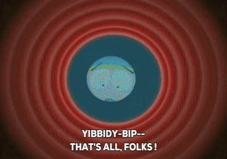
